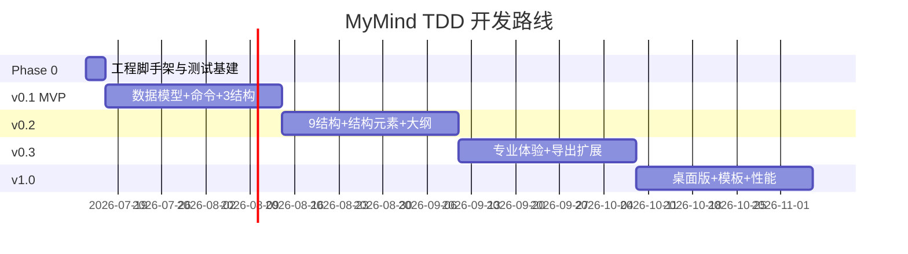

# MyMind TDD 开发规划

> 版本：v1.1  
> 更新日期：2026-07-09  
> 状态：开发基线  
> 关联：[功能特性规格](./功能特性规格.md) v1.5-draft · [技术设计文档](./技术设计文档.md) v1.5-draft

---

## 1. 概述

本文档以 **测试驱动开发（TDD）** 组织 MyMind 的分阶段开发任务，确保《功能特性规格》中的需求 ID **可追溯、不遗漏**。

- **需求来源（What）**：《功能特性规格》功能 ID、优先级、验收场景（§16）
- **实现依据（How）**：《技术设计文档》数据模型、命令、布局、组件映射（§20.2）
- **当前状态**：需求与设计已完成，代码尚未初始化

---

## 2. TDD 工作约定

### 2.1 测试金字塔

| 层级 | 工具 | 覆盖范围 | 何时写 |
|------|------|----------|--------|
| L1 单元 | Vitest | `core` 命令、布局、序列化、测量 | **每个功能先写** |
| L2 集成 | Vitest | Command → Layout → Render 管线 | 命令落地后 |
| L3 快照 | Vitest snapshot | 九种结构固定输入的布局坐标 | 布局算法完成后 |
| L4 组件 | `@vue/test-utils` | 面板、工具栏、composables | UI 接线时 |
| L5 验收 | Playwright | §16 六大验收场景 | 每阶段末（v0.1 场景 1 **必做**） |

### 2.2 单任务 TDD 节奏

```
1. Red      — 根据功能 ID 写失败测试（描述行为，不测实现细节）
2. Green    — 最小实现使测试通过
3. Refactor — 去重、抽接口，测试仍绿
4. Trace    — 在测试文件头注释 // covers: ED-002, TE-001
```

### 2.3 目录约定

与《技术设计文档》§4 Monorepo 结构对齐：

```
packages/core/src/**/__tests__/*.test.ts   # 引擎测试（主战场）
packages/web/src/**/__tests__/*.test.ts    # composable / 组件
e2e/*.spec.ts                              # 验收场景
```

### 2.4 非功能需求测试策略

| NFR | 测试方式 |
|-----|----------|
| 布局 < 100ms（500 节点） | `perf/layout.bench.ts` 基准 |
| 2000 节点流畅 | E2E + 合成大文档压测 |
| XSS | 备注 HTML 消毒单测（DOMPurify） |
| i18n | 关键文案 snapshot（zh-CN P0） |
| 序列化往返 | `fast-check` 属性测试 + 固定样例往返 |

### 2.5 每周 Definition of Done

每个 Sprint 结束必须满足：

1. **测试**：新增测试全绿；`pnpm test` 无回归
2. **追溯**：本 Sprint 功能 ID 在测试注释或 PR 描述中可检索
3. **快照**：涉及布局变更时更新 snapshot（经 review）
4. **文档**：若新增命令/接口，同步技术设计 §8.2 / §20.2
5. **演示**：至少 1 个可手动验证的用户路径

---

## 3. 阶段总览

与《功能特性规格》§15、《技术设计文档》§18 对齐：**4 阶段 × 4 周 = 16 周**。



| 阶段 | 版本 | 周期 | 交付目标 |
|------|------|------|----------|
| Phase 0 | — | Day 1–3 | monorepo + Vitest 基建 |
| Phase 1 | v0.1 | Week 1–4 | P0 核心闭环 |
| Phase 2 | v0.2 | Week 5–8 | 九结构 + 结构元素 + 大纲 |
| Phase 3 | v0.3 | Week 9–12 | 专业体验 + 导出扩展 |
| Phase 4 | v1.0 | Week 13–16 | 桌面版 + 模板 + 性能 |

---

## 4. Phase 0：工程基建（Day 1–3）

> 无功能 ID，但阻塞一切 TDD。

| # | 任务 | TDD 产出 | 完成标准 |
|---|------|----------|----------|
| 0.1 | 初始化 pnpm monorepo | `vitest.config.ts` 双包配置 | `pnpm test` 空跑通过 |
| 0.2 | `packages/core` 骨架 | `createDocument()` 占位测试 | 1 个绿测试 |
| 0.3 | `packages/web` Vue3+Vite | App 挂载 smoke test | dev server 可启 |
| 0.4 | CI 脚本 | GitHub Actions：`pnpm test && pnpm build` | 本地 + PR 一键绿 |
| 0.5 | 测试工具库 | `test-utils/`：造树工厂 `buildTree(depth,n)` | 复用于所有布局测试 |
| 0.6 | i18n 骨架 | vue-i18n 初始化测试 | zh-CN 默认（§13.5 P0） |
| 0.7 | 属性测试依赖 | `fast-check` 接入 Vitest | 1.1.7 序列化属性测可跑 |
| 0.8 | Pinia 骨架 | document 镜像 store smoke test | composables 可注入 |

---

## 5. Phase 1：v0.1 MVP（Week 1–4）

**目标**：P0 核心闭环 — 3 种结构 + 节点 CRUD + 撤销 + 画布 + 保存 + PNG。

**版本交付范围**（功能规格 §15 v0.1）：

- 思维导图、逻辑图、树状图 三种结构（**新建时选择初始结构**；会话内切换见 v0.2）
- 节点 CRUD + 键盘快捷键
- 撤销/重做
- 画布缩放平移
- 基础主题（3 套）
- 保存/打开（IndexedDB + JSON 下载）
- 导出 PNG

### Sprint 1.1 — 数据模型与命令总线（Week 1）

| 任务 | 覆盖 ID | Red 测试用例 | Green 实现 |
|------|---------|-------------|-----------|
| 1.1.1 文档/Sheet/Topic 模型 | ED-001, SH-004 | `createDocument` 含唯一根节点；`createSheet` 默认 `mindmap` | `model/factory.ts` |
| 1.1.2 CommandBus | ED-012 | `execute` 改状态；`undo` 还原；`redo` 可用；栈上限 100 | `commands/bus.ts` |
| 1.1.3 AddTopicCommand | ED-002, ED-003 | 子节点挂 parent；同级插 sibling index | `commands/add-topic.ts` |
| 1.1.4 DeleteTopicCommand | ED-005 | 删子树；根不可删 | `commands/delete-topic.ts` |
| 1.1.5 UpdateTopicTitleCommand | TE-001 | 改 title；`canMerge` 连续输入合并 | `commands/update-title.ts` |
| 1.1.6 ToggleCollapseCommand | ED-009 | `collapsed=true` 隐藏后代 | `commands/toggle-collapse.ts` |
| 1.1.7 序列化往返 | FI-003, JSON 导出 | 固定样例深相等 + `fast-check` 随机树往返 | `io/serializer.ts` |
| 1.1.8 useDocument + Pinia | — | Command 执行后 store 镜像同步 | `composables/useDocument.ts`、`stores/document.ts` |

### Sprint 1.2 — 测量与三种布局（Week 2）

| 任务 | 覆盖 ID | Red 测试用例 | Green 实现 |
|------|---------|-------------|-----------|
| 1.2.1 TextMeasurer | TE-003 | 固定宽度折行；padding 计入 Size | `layout/measure.ts` |
| 1.2.2 LayoutRegistry | — | 注册/获取策略；未知结构抛错 | `layout/registry.ts` |
| 1.2.3 mindmap 布局 | ST-001 | 5 节点树坐标 snapshot；`balanced` 左右分 | `layout/mindmap.ts` |
| 1.2.4 logic-chart 布局 | ST-002 | `direction:right` 水平层级 snapshot | `layout/logic-chart.ts` |
| 1.2.5 tree-chart 布局 | ST-003 | `top-down` 垂直层级 snapshot | `layout/tree-chart.ts` |
| 1.2.6 折叠影响布局 | ED-009 | 折叠后 `hidden=true`，bounds 缩小 | 布局集成测试 |
| 1.2.7 性能基准 | §13.1 | 500 节点 layout < 100ms | `perf/layout.bench.ts` |
| 1.2.8 Command→Layout 集成 | — | `execute(AddTopic)` 后 layout 节点数/bounds 更新 | `__tests__/pipeline-layout.test.ts` |

### Sprint 1.3 — 渲染与画布交互（Week 3）

| 任务 | 覆盖 ID | Red 测试用例 | Green 实现 |
|------|---------|-------------|-----------|
| 1.3.1 RenderPipeline | — | `buildFrame` 层顺序正确；折叠节点不出 frame；frame JSON 快照 | `render/pipeline.ts` |
| 1.3.2 视口变换 | CV-001, CV-002 | `worldToScreen`/`screenToWorld` 互逆 | `render/viewport.ts` |
| 1.3.3 HitTester | — | 点中 topic / canvas 分层命中 | `render/hit-test.ts` |
| 1.3.4 useSelection | — | 单选切换；点击命中设 selectedId；与 Command 目标一致 | `composables/useSelection.ts` |
| 1.3.5 useViewport composable | CV-001–004 | zoom 限制 0.25–4；fitToContent 算 zoom | `composables/useViewport.ts` |
| 1.3.6 CanvasView 组件 | — | 挂载后 canvas 有尺寸 | `components/canvas/` |
| 1.3.7 TextEditor 浮层 | TE-001 | 双击进入编辑；提交发 Command | `components/text-editor/` |
| 1.3.8 键盘快捷键 | Tab/Enter/Del/F2/Esc/Ctrl+Z/Y/S | composable 映射到 dispatch | `composables/useKeyboard.ts` |
| 1.3.9 Command→Layout→Render 集成 | — | 改 title 后 frame 尺寸变；增删节点后连线更新 | `__tests__/pipeline-render.test.ts` |

### Sprint 1.4 — 主题、存储、导出、UI 壳（Week 4）

| 任务 | 覆盖 ID | Red 测试用例 | Green 实现 |
|------|---------|-------------|-----------|
| 1.4.1 内置主题 3 套 | TH-001, TH-004 | `listThemes()` ≥3；`UpdateThemeCommand` 仅当前 Sheet | `theme/` |
| 1.4.2 IndexedDB 存储 | FI-001, FI-003 | save/load/list 往返；新建空白文档 | `adapters/indexeddb.ts` |
| 1.4.3 JSON 下载/打开 | FI-002, FI-003 | `downloadAsJson`；`openJsonFile` 解析 `.mymind` | `adapters/browser-export.ts` |
| 1.4.4 PNG 导出 | PNG P0 | 导出 blob size > 0 | `adapters/png-export.ts` |
| 1.4.5 StatusBar 缩放 | SB-001 | 显示当前 zoom%；预设下拉 | `components/StatusBar.vue` |
| 1.4.6 新建文档结构选择 | FI-001, ST-001–003 | 创建时选 `mindmap/logic-chart/tree-chart`；默认 mindmap | `components/NewDocumentDialog.vue` |
| 1.4.7 基础 App Shell | — | 工具栏占位 + 画布 + 状态栏 | `App.vue` |

**v0.1 E2E 验收**（Playwright **必做**）：功能规格 §16 场景 1（纯键盘 5 级子主题 ≤30s）

---

## 6. Phase 2：v0.2 结构全覆盖（Week 5–8）

**目标**：九种结构 + 结构元素 + 节点元素 + 多 Sheet + 大纲 + 复制粘贴。

**版本交付范围**（功能规格 §15 v0.2）：

- 剩余 6 种结构
- 结构切换
- 备注、标签、标记、标注 Callout
- Summary、Boundary、Relationship
- 链接子菜单（网页/主题/文件）
- 复制/粘贴、自由主题
- 多 Sheet
- 大纲视图

### Sprint 2.1 — 剩余 6 种布局（Week 5）

| 任务 | 覆盖 ID | Red 测试用例 | Green 实现 |
|------|---------|-------------|-----------|
| 2.1.1 org-chart | ST-004 | `compact` 模式间距 snapshot | `layout/org-chart.ts` |
| 2.1.2 timeline | ST-005 | `alternate` 两侧分布；`showScale` extraShape | `layout/timeline.ts` |
| 2.1.3 fishbone | ST-006 | `branchAngle=45` 斜向分支 snapshot | `layout/fishbone.ts` |
| 2.1.4 matrix | ST-007 | 2×2 SWOT；`assignMode:auto` 象限分配 | `layout/matrix.ts` |
| 2.1.5 brace-map | ST-008 | 大括号 extraShape path | `layout/brace-map.ts` |
| 2.1.6 tree-table | ST-009 | DFS 行映射；`showTreeLine` | `layout/tree-table.ts` |

> **工期缓冲**：6 种布局 snapshot 为 Week 5 优先交付；结构切换（2.2.1–2.2.2）若未完可延续至 Week 6 前半。

### Sprint 2.2 — 结构切换 + 概要/外框/关系（Week 6）

| 任务 | 覆盖 ID | Red 测试用例 | Green 实现 |
|------|---------|-------------|-----------|
| 2.2.1 UpdateSheetStructureCommand | SC-001, SC-002, SC-004, PST-001–002 | 切换后节点数不变；备注保留；snapshot 变 | `commands/update-sheet-structure.ts` |
| 2.2.2 StructurePicker UI | PST-003（P2 图标可后补） | 组件测试：选择触发 command | `property-panel/StructurePicker.vue` |
| 2.2.3 layoutSummary | SM-001–003, SM-007–008 | 连续兄弟弧线路径；非连续拒绝 | `layout/summary.ts` |
| 2.2.4 Add/DeleteSummaryCommand | SM-001, SM-002, SM-005 | 创建 summaryTopic；undo 对称 | `commands/summary.ts` |
| 2.2.5 UpdateSummaryStyleCommand | SM-006 | 弧线 color/width | `commands/update-summary-style.ts` |
| 2.2.6 layoutBoundary | BD-001–003, BD-007 | bounds 包围多 topic；padding | `layout/boundary.ts` |
| 2.2.7 Add/Update/DeleteBoundaryCommand | BD-001–006, BD-008 | 删框不删 topic | `commands/boundary.ts` |
| 2.2.8 layoutRelationship | RS-001, RS-003–004, RS-007 | straight/polyline/curve；箭头 | `layout/relationship.ts` |
| 2.2.9 Add/Update/DeleteRelationshipCommand | RS-001–002, RS-005–006 | 禁止自环；不支持跨 Sheet | `commands/relationship.ts` |
| 2.2.10 结构元素选中 | SE-001–003 | HitTest summary/boundary/relationship | `render/hit-test.ts` |
| 2.2.11 快捷键 | Ctrl+]/G/L, Delete | `useKeyboard` 集成测试 | `composables/useKeyboard.ts` |

### Sprint 2.3 — 节点元素 + 插入菜单（Week 7）

| 任务 | 覆盖 ID | Red 测试用例 | Green 实现 |
|------|---------|-------------|-----------|
| 2.3.1 备注 | EL-001, TB-004 | `UpdateNoteCommand`；面板显示 | `commands/update-note.ts`、`NotesPanel.vue` |
| 2.3.2 标签 | EL-002 | 多标签增删 | `commands/label.ts` |
| 2.3.3 标记 | EL-003 | Marker 图标 id 存取 | `commands/marker.ts` |
| 2.3.4 标注 Callout | CA-001–004, CA-006–007 | `layoutCallout` offset；引线 | `layout/callout.ts`、`commands/callout.ts` |
| 2.3.5 超链接 | EL-004a/b | URL / topicId 存储；SR-004 跳转 | `commands/hyperlink.ts` |
| 2.3.6 插入菜单 | IN-001–004 | 未选主题时禁用；子菜单结构 | `components/InsertMenu.vue` |
| 2.3.7 右键插入 | IN-002 | 右键主题弹出相同插入项 | `composables/useContextMenu.ts` |
| 2.3.8 自由主题 | ED-006 | `AddFloatingTopicCommand` 坐标 | `commands/add-floating-topic.ts` |
| 2.3.9 复制/粘贴 | ED-011 | ClipboardPayload 往返；id 重映射；跨 Sheet | `commands/clipboard.ts` |
| 2.3.10 多选 | ED-010 | selection 数组；Shift 连选逻辑 | `composables/useSelection.ts` |

### Sprint 2.4 — 多 Sheet + 大纲 + 属性面板框架（Week 8）

| 任务 | 覆盖 ID | Red 测试用例 | Green 实现 |
|------|---------|-------------|-----------|
| 2.4.1 Sheet CRUD | SH-001–003 | Add/Delete/Rename Sheet | `commands/sheet.ts` |
| 2.4.2 每 Sheet 独立结构 | SH-004, SC-004 | 切换 Sheet 结构互不影响 | 集成测试 + `Sheet.structure` |
| 2.4.3 Outliner 双向同步 | VW-001–003, TB-002, SB-002 | 大纲改 title → 画布变；删节点同步 | `components/OutlinerView.vue` |
| 2.4.4 PropertyPanel 框架 | PP-001–005, TB-006 | 三 Tab；空状态；折叠 | `property-panel/PropertyPanel.vue` |
| 2.4.5 StyleTab 基础 | PS-001–006, PT-001–006, PT-010 | 形状/文本命令 | `property-panel/StyleTab.vue` |
| 2.4.6 CanvasTab 基础 | PP-C01, PP-C04–C05 | 背景色、彩虹分支、主题 | `property-panel/CanvasTab.vue` |
| 2.4.7 拖拽排序/重组 | ED-007, ED-008 | `MoveTopicCommand` index/parent | `commands/move-topic.ts` |
| 2.4.8 布局快照全量 | — | 9 结构 × 标准树 → snapshot 入库 | `layout/__snapshots__/` |

**v0.2 E2E 验收**：功能规格 §16 场景 2、4、6

---

## 7. Phase 3：v0.3 专业体验（Week 9–12）

**目标**：P1/P2 体验补齐 — 富文本、图片、搜索、视图模式、完整导出。

**版本交付范围**（功能规格 §15 v0.3）：

- 专区 Zone、待办 To-do
- 完整主题系统
- 富文本、图片、超链接
- 分支聚焦、搜索
- ZEN / Pitch 模式
- 导出 PDF / SVG / Markdown / OPML

### Sprint 3.1 — 富文本、图片、链接扩展（Week 9）

| 任务 | 覆盖 ID | Red 测试用例 | Green 实现 |
|------|---------|-------------|-----------|
| 3.1.1 InlineRun 富文本 | TE-002 | runsToPlain；逐 run 测量宽度 | `model/inline-run.ts`、`layout/measure.ts` |
| 3.1.2 UpdateTopicTitleCommand 扩展 | TE-002 | title + titleRich 同步 | `commands/update-title.ts` |
| 3.1.3 本地图片 | EL-005 | ImageAttachment 存取；measure 叠加尺寸 | `commands/image.ts` |
| 3.1.4 文件链接 | EL-004c | path 字段；Web 降级提示 | `commands/hyperlink.ts` |
| 3.1.5 附件 | EL-006 | FileAttachment blobRef | `commands/attachment.ts` |
| 3.1.6 XSS 过滤 | §13.4 | DOMPurify 备注 HTML 单测 | `utils/sanitize.ts` |
| 3.1.7 完整主题 ≥10 | TH-001 | `listThemes()` ≥10 | `theme/presets/` |

### Sprint 3.2 — 专区、待办、任务（Week 10）

| 任务 | 覆盖 ID | Red 测试用例 | Green 实现 |
|------|---------|-------------|-----------|
| 3.2.1 Zone CRUD | ZN-001–006 | 不可包裹中心主题；折叠 | `commands/zone.ts` |
| 3.2.2 layoutZone | ZN-002–004 | bounds + 手动 resize | `layout/zone.ts` |
| 3.2.3 Todo | TD-001–004 | 勾选；完成率 2/5 显示 | `commands/todo.ts` |
| 3.2.4 Task | EL-020 | 日期/负责人/优先级字段 | `model/task.ts` |
| 3.2.5 智能配色 | TH-002 | 种子色生成色板 | `theme/color-gen.ts` |
| 3.2.6 自定义主题 | TH-003 | 保存/加载用户主题 | `theme/custom.ts` |
| 3.2.7 手绘风格 | TH-006, PP-C06 | handDrawn 标志影响渲染 | `render/hand-drawn.ts` |

### Sprint 3.3 — 搜索、聚焦、视图模式（Week 11）

| 任务 | 覆盖 ID | Red 测试用例 | Green 实现 |
|------|---------|-------------|-----------|
| 3.3.1 SearchService | SR-001–002 | 搜 title/note/label；结果列表 | `search/service.ts` |
| 3.3.2 搜索高亮跳转 | VW-031 | 选中并居中 | `composables/useSearch.ts` |
| 3.3.3 分支聚焦 | VW-030 | 隐藏非后代节点 | `composables/useBranchFocus.ts` |
| 3.3.4 按标签筛选 | VW-032 | filter by labelId | `composables/useLabelFilter.ts` |
| 3.3.5 ZEN 模式 | VW-010–012 | UI 状态隐藏面板；Esc 退出 | `composables/useZenMode.ts` |
| 3.3.6 Pitch 模式 | VW-020–022, TB-003, PP-P01–P05 | 帧列表；导航；缩放动画 | `composables/usePitchMode.ts`、`PitchTab.vue` |
| 3.3.7 大纲多列 | VW-004 | 显示标签、标记列 | `OutlinerView.vue` 列配置 |
| 3.3.8 纯大纲模式 | VW-005 | 全屏大纲，隐藏画布 | `composables/useOutlinerOnly.ts` |
| 3.3.9 自动保存 | FI-005 | 30s 定时 dispatch save | `composables/useAutoSave.ts` |
| 3.3.10 最近文件 | FI-006 | meta 列表排序 | `adapters/recent-files.ts` |
| 3.3.11 另存为 | FI-004 | 新 id 保存副本 | `commands/save-as.ts` |

### Sprint 3.4 — 导出/导入扩展（Week 12）

| 任务 | 覆盖 ID | Red 测试用例 | Green 实现 |
|------|---------|-------------|-----------|
| 3.4.1 SVG 导出 | SVG P1 | 含 structure elements | `io/exporters/svg.ts` |
| 3.4.2 PDF 导出 | PDF P1 | 矢量或高分辨率 | `io/exporters/pdf.ts` |
| 3.4.3 Markdown 导出 | Markdown P1 | 标题层级 | `io/exporters/markdown.ts` |
| 3.4.4 OPML 导出 | OPML P1 | outline 结构 | `io/exporters/opml.ts` |
| 3.4.5 Markdown 导入 | Markdown P1 | 标题 → 树 | `io/importers/markdown.ts` |
| 3.4.6 OPML 导入 | OPML P1 | 往返测试 | `io/importers/opml.ts` |
| 3.4.7 导出选项 | §8.5 | 1x/2x/3x；透明背景；当前/全部 Sheet | `io/export-options.ts` |
| 3.4.8 SE-005 | 结构元素导出可见 | PNG/SVG 含 summary/boundary/rel | 导出集成测试 |
| 3.4.9 主工具栏 | TB-007 | 撤销/重做/插入/结构入口 | `components/TopBar.vue` |
| 3.4.10 格式刷 | TB-007 | 复制样式；应用到选中节点 | `commands/format-painter.ts`、`FormatPainter.vue` |

**v0.3 E2E 验收**：功能规格 §16 场景 3、5（Web 端文件往返）

---

## 8. Phase 4：v1.0 正式版（Week 13–16）

**目标**：方程、装饰素材、模板、完整导入、Tauri、性能、打印。

**版本交付范围**（功能规格 §15 v1.0）：

- 方程、贴纸、插画
- Tauri 桌面打包
- 模板库
- 完整导入
- 打印
- 性能优化（2000 节点）

### Sprint 4.1 — 方程、贴纸、插画、评论（Week 13）

| 任务 | 覆盖 ID | Red 测试用例 | Green 实现 |
|------|---------|-------------|-----------|
| 4.1.1 KaTeX 方程 | EQ-001–004, EL-034, TE-004 | 渲染预览；导出含公式 | `render/equation.ts`、`commands/equation.ts` |
| 4.1.2 CanvasDecoration | EL-022–023, SK-001–004 | 独立层级；缩放旋转 | `model/decoration.ts`、`commands/decoration.ts` |
| 4.1.3 本地评论 | CM-001–002 | Comment CRUD；侧边时间线 | `commands/comment.ts`、`CommentPanel.vue` |
| 4.1.4 文本样式补全 | PT-007–009 | 删除线/下划线/大小写 | `commands/update-topic-style.ts` |
| 4.1.5 概要范围拖拽 | SM-004 | 端点调整 topicRange | `commands/update-summary-range.ts` |
| 4.1.6 外框嵌套/边距 | BD-004, BD-009 | padding 手动调 | `commands/update-boundary.ts` |
| 4.1.7 关系控制点 | RS-008 | curve controlPoints | `commands/update-relationship.ts` |

### Sprint 4.2 — 模板库 + 完整导入（Week 14）

| 任务 | 覆盖 ID | Red 测试用例 | Green 实现 |
|------|---------|-------------|-----------|
| 4.2.1 内置模板 ≥10 | TP-001–003 | 学习/工作/生活/分析各 ≥2；v1.0 先 10 套 | `templates/presets/` |
| 4.2.2 模板扩展至 20 | TP-001 | 在 4.2.1 基础上扩展（P2，可延后） | `templates/presets/` |
| 4.2.3 模板分类 | TP-002 | 分类筛选列表 | `components/TemplatePicker.vue` |
| 4.2.4 从模板新建 | TP-003, FI-001 | 选模板 → createDocument | `adapters/template-loader.ts` |
| 4.2.5 XMind 导入 | XMind P2 | 只读解析 .xmind | `io/importers/xmind.ts` |
| 4.2.6 FreeMind 导入 | FreeMind P3 | .mm 解析 | `io/importers/freemind.ts` |
| 4.2.7 纯文本缩进导入 | P3 | 缩进 → 树 | `io/importers/plain-text.ts` |
| 4.2.8 Word 导出 | Word P2 | docx 大纲 | `io/exporters/word.ts` |
| 4.2.9 Excel 导出 | Excel P2 | tree-table → xlsx | `io/exporters/excel.ts` |

### Sprint 4.3 — Tauri 桌面 + 打印（Week 15）

| 任务 | 覆盖 ID | Red 测试用例 | Green 实现 |
|------|---------|-------------|-----------|
| 4.3.1 Tauri 壳 | §1.3 Phase 3 | 应用启动 smoke | `src-tauri/` |
| 4.3.2 文件对话框 | FI-002, FI-003 | 原生 open/save `.mymind`（桌面端增强） | `adapters/tauri-file.ts` |
| 4.3.3 TauriFileStorage | §16 场景 5 | 与 Web JSON 格式一致 | `adapters/tauri-storage.ts` |
| 4.3.4 文件链接桌面 | EL-004c | 本地 path 打开 | `adapters/tauri-shell.ts` |
| 4.3.5 系统菜单快捷键 | — | 原生菜单映射 | `src-tauri/menu.rs` |
| 4.3.6 打印预览 | PR-001–002 | 分页；纸张设置 | `components/PrintPreview.vue` |
| 4.3.7 多 Sheet 打印 | PR-003 | 范围选择 | `composables/usePrint.ts` |
| 4.3.8 PPT 导出 | VW-023, PP-P06 | pptx 帧（P3 可 MVP） | `io/exporters/pptx.ts` |

### Sprint 4.4 — 性能优化 + 收尾（Week 16）

| 任务 | 覆盖 ID | Red 测试用例 | Green 实现 |
|------|---------|-------------|-----------|
| 4.4.1 视口裁剪 | §13.1 | visibleNodeCount << nodeCount | `render/culling.ts` |
| 4.4.2 离屏缓存 | §13.1 | 静态层缓存命中 | `render/cache.ts` |
| 4.4.3 2000 节点压测 | §13.1 | 编辑帧率 ≥30fps bench | `perf/edit.bench.ts` |
| 4.4.4 首屏分包 | §13.1 | core/UI 代码分割；<2s | `vite.config.ts` |
| 4.4.5 无障碍 | §13.3 P1–P2 | Tab 焦点链；焦点可见 | a11y 组件测试 |
| 4.4.6 英文界面 | §13.5 P2 | en-US 文案覆盖 | `locales/en-US.json` |
| 4.4.7 P3 收尾项 | 见 §9.4 | 按优先级排期 | — |

**v1.0 E2E 验收**：功能规格 §16 全部 6 场景 + 2000 节点流畅性

---

## 9. 需求全覆盖追溯矩阵

### 9.1 P0（v0.1 必须）— Phase 1 覆盖

| 模块 | 功能 ID | 说明 |
|------|---------|------|
| 节点树 | ED-001, ED-002, ED-003, ED-005, ED-009, ED-012 | |
| 文字 | TE-001, TE-003 | |
| 快捷键 | Tab, Enter, Del, F2, Esc, Ctrl+Z/Y, Ctrl+S, Ctrl+滚轮 | |
| 画布 | CV-001, CV-002, CV-003, CV-004 | |
| 结构 | ST-001, ST-002, ST-003, SH-004 | v0.1 **新建时选初始结构**；不含会话内切换（见 v0.2） |
| 文件 | FI-001, FI-002, FI-003 | Web：IndexedDB + `.mymind` 下载/打开 |
| 导出 | PNG, JSON | |
| 状态栏 | SB-001 | |
| i18n | 中文界面 | |

### 9.2 P1（v0.2–v0.3）— Phase 2–3 覆盖

| 簇 | 功能 ID |
|----|---------|
| 结构切换 | SC-001, SC-002, SC-004, PST-001, PST-002 |
| 编辑增强 | ED-006–011, TE-002 |
| 九结构剩余 | ST-004–009 |
| 结构元素 | SM-001–008, BD-001–008, RS-001–007, SE-001–003, SE-005, CA-001–007 |
| 节点元素 | EL-001–005, EL-010–012 |
| 插入菜单 | IN-001–004, IN-002 |
| 属性面板 | PP-001–005, PS-001–006, PT-001–006, PT-010, PST-001, PP-C01/04/05 |
| 主题 | TH-001, TH-004, TH-005 |
| 大纲/搜索 | VW-001–003, VW-030–032, SR-001–002, SR-004 |
| 顶栏/底栏 | TB-002, TB-004, TB-006, TB-007, SB-002 |
| 多 Sheet | SH-001–003 |
| 导出 | PDF, SVG, Markdown, OPML |
| 导入 | Markdown, OPML |
| 文件 | FI-004–006 |

### 9.3 P2（v0.3–v1.0）— Phase 3–4 覆盖

| 簇 | 功能 ID |
|----|---------|
| 编辑 | ED-004, Shift+Tab, Space, 方向键 |
| 专区/待办/任务 | ZN-001–006, TD-001–004, EL-020, EL-004c, EL-006 |
| 主题扩展 | TH-002, TH-003, TH-006, PP-C03/C06 |
| 视图模式 | VW-004–005, VW-010–012, VW-020–022, VW-032 |
| 演说 | PP-P01–P05 |
| 文件 | FI-005–006 |
| 导入导出 | XMind 导入, Word/Excel 导出 |
| 模板/打印 | TP-001–003, PR-001–003 |
| 方程/结构元素增强 | EQ-001–004, SM-004, BD-004/009, RS-008, CA-005 |

### 9.4 P3 / v1.0+ backlog — Phase 4 收尾

> **2026-07-17**：下列 P3 项已在 core/web 落地（见 `p3-features.test.ts`）。仍待体验打磨的可在后续迭代补强。

| ID | 状态 |
|----|------|
| TE-005, SB-003, TB-001(只读副本), TB-005, PT-009, SE-006, PP-C07, TP-004, SC-003, TextBundle zip | ✅ |
| CV-005, CV-006(对齐算法+辅助线绘制), SH-005, IN-005 | ✅ |
| ZN-007–009, TD-005, CM 增删改, EL-021–023, SK-001–004 | ✅ |
| PP-P04/P06, VW-023(真实 pptx), FI-007(AES-GCM v2), FI-008, SR-003, PR-003 | ✅ |
| FreeMind/纯文本导入, §13.3 大纲 ARIA + 选中 live region | ✅ |

### 9.5 刻意排除（v2.0，架构预留，不写测试）

与《文档同步对照》「已知刻意差异」一致：

| 范围 | 原因 |
|------|------|
| SB-004 AI 点数 | v2.0 |
| TB-001 云端分享链接 | v2.0（本地只读副本已实现） |
| CM-003–005 协作评论 | 需后端 |
| §12 实时协作 / 云同步 / AI / 甘特 | v2.0 |
| Phase 2 PWA | 技术设计刻意延后 |

### 9.6 已映射、待 Sprint 排期（P2–P3）

| ID | 优先级 | 建议阶段 |
|----|--------|----------|
| ED-004 添加父主题 | P2 | v1.0+ 或 Phase 4 缓冲周 |
| SE-004 结构元素复制粘贴 | P2 | v0.2 后补；随 Sheet 复制默认覆盖 |
| PP-C03 全局字体 | P2 | Phase 3 缓冲 |
| CA-005 标注样式 | P2 | Phase 3 缓冲 |
| PST-003 结构图标 | P2 | Phase 2 可后补（2.2.2 已标注） |

### 9.7 基础设施任务（无功能 ID）

| 任务 | Sprint | 说明 |
|------|--------|------|
| LayoutRegistry | 1.2.2 | 布局插件注册，非用户功能 |
| useDocument + Pinia | 1.1.8 | 文档状态镜像 |
| useSelection | 1.3.4 | 选区状态，Tab/Enter 前置依赖 |
| Command→Layout 集成 | 1.2.8 | L2 管线 |
| Command→Layout→Render 集成 | 1.3.9 | L2 管线 |
| RenderPipeline frame 快照 | 1.3.1 | 渲染回归 |
| Pinia / fast-check / CI | Phase 0 | 测试基建 |

---

## 10. 验收场景与阶段映射

| 场景 | 描述 | 验收阶段 |
|------|------|----------|
| 场景 1 | 纯键盘快速头脑风暴 | v0.1 |
| 场景 2 | 结构切换保留数据 | v0.2 |
| 场景 3 | SWOT 矩阵分析导出 | v0.3 |
| 场景 4 | 大纲与画布双向同步 | v0.2 |
| 场景 5 | 跨平台文件一致 | v0.3（Web）/ v1.0（Tauri） |
| 场景 6 | 概要/外框/关系 + 导出 | v0.2 |

---

## 11. 关联文档

| 文档 | 关系 |
|------|------|
| [功能特性规格](./功能特性规格.md) | 需求 ID、优先级、验收标准（What） |
| [技术设计文档](./技术设计文档.md) | 命令、布局、组件映射（How） |
| [文档同步对照](./文档同步对照.md) | 版本对齐与维护约定 |

### 11.1 维护约定

1. **新增功能** → 先在功能规格分配 ID，再在本规划对应 Sprint 补任务行
2. **调整里程碑** → 同步功能规格 §15、技术设计 §18、本文档 §3
3. **测试落地** → 测试文件头注释 `covers:` 功能 ID，便于 grep 追溯

### 11.2 文档修订记录

| 版本 | 日期 | 说明 |
|------|------|------|
| v1.0 | 2026-07-09 | 初始版本：TDD 分阶段规划与需求追溯矩阵 |
| v1.1 | 2026-07-09 | 评审修订：修正 §9.1 结构切换归属；补 Phase 1 选区/管线/FI-002；统一 Phase 2–4 四列表格；拆 Week 5 布局与结构切换；补 IN-002/VW-004/005/格式刷；增 §9.6–9.7 |
