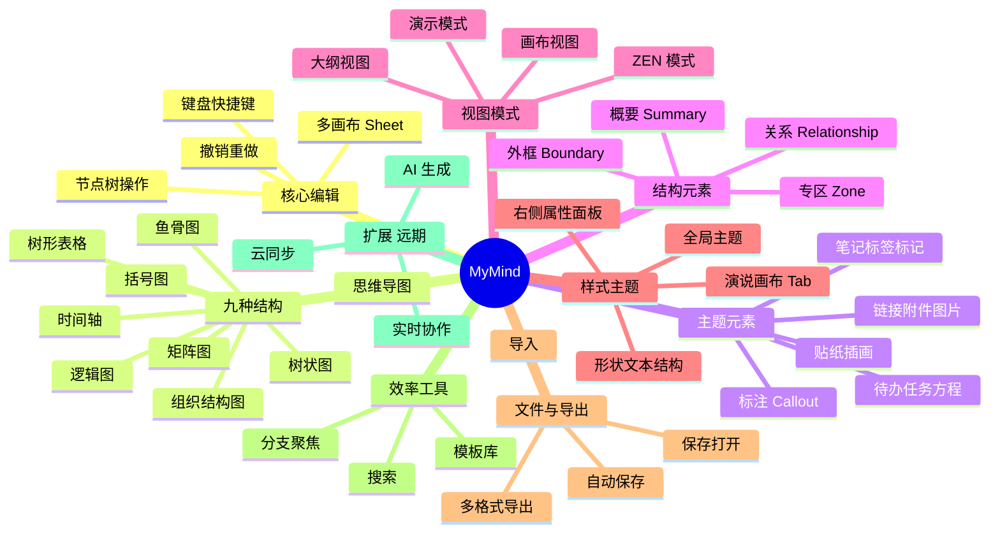

# MyMind 功能特性规格

> 版本：v1.6-draft  
> 更新日期：2026-07-17  
> 状态：需求基线

---

## 1. 产品概述

### 1.1 产品愿景

打造一款在编辑流畅度、结构丰富度和导出质量上对标 XMind 的思维导图工具。用户可在同一套思维数据中自由切换九种可视化结构，无需重复录入。

### 1.2 目标用户

| 用户类型 | 典型场景 |
|----------|----------|
| 学生 / 研究者 | 读书笔记、论文结构、知识梳理 |
| 产品经理 | 需求拆解、用户旅程、竞品分析（矩阵） |
| 项目经理 | 任务分解、时间轴规划、进度跟踪 |
| 咨询师 / 培训师 | 客户交付物、演示文稿、SWOT 分析 |
| 开发者 | 技术方案、模块依赖、架构梳理 |

### 1.3 平台策略

| 阶段 | 平台 | 说明 |
|------|------|------|
| Phase 1 | Web（浏览器） | 主开发目标，IndexedDB 本地存储 |
| Phase 2 | PWA | 可安装、基础离线 |
| Phase 3 | Tauri 桌面 | 本地文件关联、系统菜单、托盘 |

---

## 2. 功能模块总览



---

## 3. 核心编辑功能

### 3.1 节点树操作

| 功能 ID | 功能名称 | 描述 | 优先级 |
|---------|----------|------|--------|
| ED-001 | 中心主题 | 每张 Sheet 有唯一根节点（中心主题） | P0 |
| ED-002 | 添加子主题 | 选中节点后添加下级节点 | P0 |
| ED-003 | 添加同级主题 | 添加与当前节点同级的兄弟节点 | P0 |
| ED-004 | 添加父主题 | 在当前节点上方插入父级（可选） | P2 |
| ED-005 | 删除节点 | 删除节点及其子树，需确认 | P0 |
| ED-006 | 自由主题 | 在画布任意位置放置不挂树的独立节点 | P1 |
| ED-007 | 拖拽排序 | 拖拽节点改变同级顺序 | P1 |
| ED-008 | 拖拽重组 | 拖拽节点到其他父节点下 | P1 |
| ED-009 | 折叠/展开 | 折叠子树，显示折叠指示器 | P0 |
| ED-010 | 多选 | Shift/Ctrl 多选节点批量操作 | P1 |
| ED-011 | 复制/粘贴 | 复制子树到剪贴板，支持跨 Sheet | P1 |
| ED-012 | 撤销/重做 | 无限层级撤销（内存上限可配置） | P0 |

### 3.2 文字编辑

| 功能 ID | 功能名称 | 描述 | 优先级 |
|---------|----------|------|--------|
| TE-001 | 行内编辑 | 双击或按键进入编辑态 | P0 |
| TE-002 | 富文本 | 局部加粗、斜体、下划线、颜色、字号 | P1 |
| TE-003 | 自动换行 | 节点宽度限制下自动折行 | P0 |
| TE-004 | 公式/方程 | LaTeX 公式，见 EL-034 | P2 |
| TE-005 | 字数统计 | 备注/节点字数（可选） | P3 |

### 3.3 键盘快捷键

| 快捷键 | 行为 | 优先级 |
|--------|------|--------|
| `Tab` | 新建子主题 | P0 |
| `Enter` | 新建同级主题 | P0 |
| `Shift+Tab` | 提升层级 / 新建父级 | P2 |
| `Delete` / `Backspace` | 删除节点 | P0 |
| `F2` | 编辑当前节点 | P0 |
| `Space` | 展开/折叠 | P1 |
| `Ctrl+Z` / `Ctrl+Y` | 撤销 / 重做 | P0 |
| `Ctrl+C` / `Ctrl+V` | 复制 / 粘贴 | P1 |
| `Ctrl+S` | 保存 | P0 |
| `Ctrl+F` | 搜索 | P1 |
| `Ctrl+滚轮` | 缩放 | P0 |
| `方向键` | 在节点间导航 | P1 |
| `Escape` | 退出编辑 / 取消选中 | P0 |
| `Ctrl + ]` | 添加概要 | P1 |
| `Ctrl + G` | 添加外框 | P1 |
| `Ctrl + L` | 关系创建模式 | P1 |

### 3.4 画布交互

| 功能 ID | 功能名称 | 描述 | 优先级 |
|---------|----------|------|--------|
| CV-001 | 缩放 | 25%–400%，滚轮 / 按钮 / 手势 | P0 |
| CV-002 | 平移 | 拖拽空白区域或空格+拖拽 | P0 |
| CV-003 | 居中 | 一键居中根节点或选中分支 | P0 |
| CV-004 | 适应窗口 | 缩放至全部内容可见 | P0 |
| CV-005 | 小地图 | 右下角导航缩略图 | P2 |
| CV-006 | 网格/对齐线 | 拖拽时的辅助对齐（可选） | P3 |

### 3.5 多画布（Sheet）

| 功能 ID | 功能名称 | 描述 | 优先级 |
|---------|----------|------|--------|
| SH-001 | 多 Sheet | 一个文档包含多个画布页 | P1 |
| SH-002 | 添加/删除 Sheet | 底部标签页管理 | P1 |
| SH-003 | 重命名 Sheet | 双击标签改名 | P1 |
| SH-004 | 独立结构 | 每个 Sheet 可使用不同结构类型 | P0 |
| SH-005 | 复制 Sheet | 复制整页内容 | P2 |

### 3.6 顶部工具栏

对标 XMind 顶部右侧快捷操作区：

| 功能 ID | 功能名称 | 描述 | 优先级 |
|---------|----------|------|--------|
| TB-001 | 分享 | 生成分享链接 / 导出只读副本（v2.0 协作；v1.0 可先导出链接） | P3 |
| TB-002 | 大纲 | 切换大纲侧栏显示/隐藏 | P1 |
| TB-003 | 演说 | 进入 Pitch 演示模式 | P2 |
| TB-004 | 笔记面板 | 打开选中主题的备注编辑侧栏 | P1 |
| TB-005 | 标记/贴纸 | 快速打开标记与贴纸选择器 | P2 |
| TB-006 | 属性面板开关 | 折叠/展开右侧属性面板 | P1 |
| TB-007 | 主工具栏 | 左侧：撤销/重做、格式刷、插入、结构等 | P1 |

### 3.7 底部状态栏

| 功能 ID | 功能名称 | 描述 | 优先级 |
|---------|----------|------|--------|
| SB-001 | 缩放控制 | 显示当前比例（如 100%），下拉预设 25%–400% | P0 |
| SB-002 | 大纲入口 | 「大纲」文字按钮，同 TB-002 | P1 |
| SB-003 | 画布信息 | 可选显示节点数、当前 Sheet 名 | P3 |
| SB-004 | AI 点数 | AI 功能入口与余额显示（v2.0，初期可隐藏） | v2.0 |

---

## 4. 九种结构形式

所有结构共享同一棵 Topic 树。切换结构时保留数据，仅重新布局与渲染。

### 4.1 结构一览

| 功能 ID | 结构名称 | 英文标识 | 描述 | 优先级 |
|---------|----------|----------|------|--------|
| ST-001 | 思维导图 | `mindmap` | 中心放射，子主题左右平衡分布 | P0 |
| ST-002 | 逻辑图 | `logic-chart` | 单向水平层级，常用于流程推导 | P0 |
| ST-003 | 树状图 | `tree-chart` | 自上而下（或自下而上）层次树 | P0 |
| ST-004 | 组织结构图 | `org-chart` | 分层水平排列，适合层级组织 | P1 |
| ST-005 | 时间轴 | `timeline` | 沿时间主轴排列事件；多级子树沿主轴方向树状展开 | P1 |
| ST-006 | 鱼骨图 | `fishbone` | 因果分析，主干 + 斜向分支 | P1 |
| ST-007 | 矩阵图 | `matrix` | N×M 象限网格，如 SWOT | P1 |
| ST-008 | 括号图 | `brace-map` | 整体-部分关系，大括号连接 | P1 |
| ST-009 | 树形表格 | `tree-table` | 树形层级以表格行展示 | P1 |

### 4.2 各结构配置项

#### 思维导图（mindmap）

| 配置项 | 类型 | 默认值 | 说明 |
|--------|------|--------|------|
| balanced | boolean | false | 子主题左右平衡分布 |
| direction | enum | right | 分支展开方向偏好 |

#### 逻辑图（logic-chart）

| 配置项 | 类型 | 默认值 | 说明 |
|--------|------|--------|------|
| direction | left \| right | right | 展开方向 |
| lineStyle | curve \| polyline | curve | 连线样式 |
| nodeDisplay | box \| underline \| mixed | mixed | 节点外观；mixed 时有嵌套子树用方框，叶组用下划线 |
| groupLeaves | none \| brace | none | 叶级兄弟是否用括号归组 |
| rootDisplay | box \| underline | box | 根节点外观 |

#### 树状图（tree-chart）

| 配置项 | 类型 | 默认值 | 说明 |
|--------|------|--------|------|
| direction | top-down \| bottom-up | top-down | 生长方向 |

#### 组织结构图（org-chart）

| 配置项 | 类型 | 默认值 | 说明 |
|--------|------|--------|------|
| compact | boolean | false | 紧凑模式，减少层间距 |

#### 时间轴（timeline）

| 配置项 | 类型 | 默认值 | 说明 |
|--------|------|--------|------|
| axis | horizontal \| vertical | horizontal | 主轴方向 |
| alternate | boolean | true | 子节点交替排列在主轴两侧 |
| showScale | boolean | true | 显示刻度/时间节点 |

#### 鱼骨图（fishbone）

| 配置项 | 类型 | 默认值 | 说明 |
|--------|------|--------|------|
| headPosition | left \| right | left | 鱼头（根主题）位置 |
| branchAngle | number | 45 | 一级分支角度（技术设计字段名同此） |

#### 矩阵图（matrix）

| 配置项 | 类型 | 默认值 | 说明 |
|--------|------|--------|------|
| rows | number | 2 | 行数 |
| cols | number | 2 | 列数 |
| titles | string[] | SWOT 默认 | 象限标题 |
| assignMode | auto \| manual | auto | 子节点分配方式 |

#### 括号图（brace-map）

| 配置项 | 类型 | 默认值 | 说明 |
|--------|------|--------|------|
| braceSide | left \| right | right | 大括号相对根主题的所在侧（right=根左部分右） |
| partPosition | opposite \| same | opposite | opposite：根与部分分居括号两侧；same：同列缩进 |

#### 树形表格（tree-table）

| 配置项 | 类型 | 默认值 | 说明 |
|--------|------|--------|------|
| columns | ColumnDef[] | title, note | 可见列定义 |
| showTreeLine | boolean | true | 显示层级缩进线 |

### 4.3 结构切换

| 功能 ID | 功能名称 | 描述 | 优先级 |
|---------|----------|------|--------|
| SC-001 | 一键切换 | 工具栏选择结构，即时重布局 | P0 |
| SC-002 | 保留数据 | 切换不丢失节点、备注、样式 | P0 |
| SC-003 | 结构预览 | 切换前预览缩略示意（可选） | P3 |
| SC-004 | 每 Sheet 独立 | 不同 Sheet 可用不同结构 | P0 |

### 4.4 结构切换限制说明

| 结构 | 特殊约束 |
|------|----------|
| 矩阵图 | 根节点为主题标题；一级子节点映射象限，二级及以下在象限内递归缩进纵向排列 |
| 时间轴 | 建议一级子节点带时间属性；无时间属性时按顺序排列；二级及以下沿主轴方向树状展开（多级时间轴） |
| 鱼骨图 | 一级子节点为「主因类别」（斜骨末端），二级及以下为水平刺骨上的具体原因 |
| 树形表格 | 渲染为表格，编辑行为与树节点双向同步 |

---

## 5. 节点元素（Topic Elements）

### 5.0 插入菜单（对齐 XMind）

工具栏 **「+ 插入」** 下拉菜单与快捷图标，对标 XMind 可插入元素一览：

| 菜单项 | XMind 名称 | 文档功能 ID | 覆盖状态 | 优先级 |
|--------|-----------|-------------|----------|--------|
| 工具栏图标 | 关系 Relationship | EL-012 | ✅ 已规格化 | P1 |
| 工具栏图标 | 外框 Boundary | EL-011 | ✅ 已规格化 | P1 |
| 工具栏图标 | 概要 Summary | EL-010 | ✅ 已规格化 | P1 |
| 插入 → 专区 | Zone | EL-030 | ✅ v1.2 新增 | P2 |
| 插入 → 笔记 | Note | EL-001 | ✅ 已有 | P1 |
| 插入 → 标签 | Label | EL-002 | ✅ 已有 | P1 |
| 插入 → 标注 | Callout | EL-031 | ✅ v1.2 新增 | P1 |
| 插入 → 评论 | Comment | EL-032 | ✅ v1.2 新增 | P3 |
| 插入 → 待办事项 | To-do | EL-033 | ✅ v1.2 新增 | P2 |
| 插入 → 任务 | Task | EL-020 | ✅ 已有（需与待办区分） | P2 |
| 插入 → 链接 → 网页 | Web Link | EL-004a | ✅ 合并入 EL-004 | P1 |
| 插入 → 链接 → 主题 | Topic Link | EL-004b | ✅ 合并入 EL-004 | P1 |
| 插入 → 链接 → 文件 | File Link | EL-004c | ✅ v1.2 新增 | P2 |
| 插入 → 附件 | Attachment | EL-006 | ✅ 已有 | P2 |
| 插入 → 贴纸 | Sticker | EL-022 | ✅ 已有 | P3 |
| 插入 → 插画 | Illustration | EL-023 | ✅ 已有 | P3 |
| 插入 → 本地图片 | Local Image | EL-005 | ✅ 已有 | P1 |
| 插入 → 方程 | Equation | EL-034 / TE-004 | ✅ v1.2 细化 | P2 |

> **说明**：XMind 部分项标注 PRO/PRO+；MyMind v1.0 不按付费墙裁剪，但可按版本分期实现（见优先级列）。

#### 5.0.1 插入菜单交互

| 功能 ID | 功能名称 | 描述 | 优先级 |
|---------|----------|------|--------|
| IN-001 | 插入下拉 | 工具栏「+」打开分组插入菜单 | P1 |
| IN-002 | 右键插入 | 右键主题弹出相同插入项（上下文相关） | P1 |
| IN-003 | 子菜单 | 「链接」展开网页 / 主题 / 文件子项 | P1 |
| IN-004 | 禁用态 | 当前不可用的项置灰（如未选主题时） | P1 |
| IN-005 | 最近使用 | 菜单顶部展示最近 3 个插入项（可选） | P3 |

```
工具栏:  [关系] [外框] [概要] [+插入▼]
                          │
          ┌───────────────┼───────────────┐
          │ 专区          │ 笔记  标签     │
          │ 标注  评论    │ 待办  任务     │
          │ 链接 ▶        │ 附件           │
          │   ├ 网页      │ 贴纸  插画     │
          │   ├ 主题      │ 本地图片       │
          │   └ 文件      │ 方程           │
          └───────────────┴───────────────┘
```

### 5.1 基础元素

| 功能 ID | 元素 | 描述 | 优先级 |
|---------|------|------|--------|
| EL-001 | 备注 Notes | 节点附属富文本详细说明 | P1 |
| EL-002 | 标签 Label | 彩色文字标签，可多个 | P1 |
| EL-003 | 标记 Marker | 图标库（优先级、进度、表情等） | P1 |
| EL-004 | 超链接 Hyperlink | 支持网页、主题链接、本地文件链接 | P1 |
| EL-004a | 网页链接 | 输入 URL，点击在浏览器打开 | P1 |
| EL-004b | 主题链接 | 链接到本图其他主题，点击跳转并居中 | P1 |
| EL-004c | 文件链接 | 链接本地文件/文件夹（桌面端完整支持） | P2 |
| EL-005 | 本地图片 | 从本机选择图片嵌入节点，可调整大小 | P1 |
| EL-006 | 附件 Attachment | 挂载任意文件，点击打开/下载 | P2 |

### 5.2 结构元素（概要 / 外框 / 关系）

> 这三类是 XMind 区别于「纯树形图」的核心能力，不属于 Topic 树层级，而是 **Sheet 级附属对象**，在布局完成后叠加渲染。

| 功能 ID | 元素 | 描述 | 优先级 |
|---------|------|------|--------|
| EL-010 | 概要 Summary | 对同级连续分支加弧形概要线 + 概要主题 | P1 |
| EL-011 | 外框 Boundary | 圈选多个主题的分组边框，可命名 | P1 |
| EL-012 | 联系 Relationship | 任意两主题间自定义连线 + 文字 | P1 |

#### 5.2.1 概要（Summary）

**定义**：对同一父主题下 **连续排列** 的若干同级子主题，在其外侧绘制一条弧形概要线，并在弧线末端附带一个 **概要主题** 节点用于填写总结文字。

| 功能 ID | 功能名称 | 描述 | 优先级 |
|---------|----------|------|--------|
| SM-001 | 创建概要 | 选中同级连续子主题（≥2），添加概要 | P1 |
| SM-002 | 概要主题 | 自动生成概要主题节点，可编辑标题 | P1 |
| SM-003 | 概要弧线 | 弧线包裹选中分支的外侧边缘 | P1 |
| SM-004 | 范围调整 | 拖拽概要端点扩展/缩小覆盖范围（可选） | P2 |
| SM-005 | 删除概要 | 删除概要线及关联概要主题 | P1 |
| SM-006 | 样式设置 | 弧线颜色、粗细、线型 | P1 |
| SM-007 | 折叠联动 | 被概要分支折叠时，概要弧线随之隐藏 | P1 |
| SM-008 | 多概要共存 | 同一父主题下可有多个不重叠概要 | P1 |

**创建流程**：

1. 用户选中同一父节点下的连续同级子主题（Shift 连选或框选）
2. 点击工具栏「概要」或快捷键 `Ctrl + ]`
3. 系统在选中范围外侧生成弧形概要线
4. 弧线末端出现概要主题，自动进入编辑态

**约束规则**：

| 规则 | 说明 |
|------|------|
| 同级要求 | 概要范围必须是同一父主题下的同级节点 |
| 连续要求 | 范围在兄弟排序中必须连续，不可跨段 |
| 不含父节点 | 概要目标为子分支，不包含父主题本身 |
| 结构兼容 | 思维导图 / 逻辑图 / 树状图 / 组织图均支持；矩阵 / 时间轴 / 树形表格 v0.2 暂不支持 |
| 切换保留 | 切换结构后概要数据保留，布局按新结构重算弧线 |

**视觉规格**：

```
父主题 ──┬── 子主题 A ──┐
         ├── 子主题 B ──┤  ╭── 弧形概要线
         └── 子主题 C ──┘  ╰──→ [概要主题：小结]
```

#### 5.2.2 外框（Boundary）

**定义**：用圆角矩形边框将若干主题（可跨分支、不必同级）圈为一组，表达逻辑分组或区域划分。

| 功能 ID | 功能名称 | 描述 | 优先级 |
|---------|----------|------|--------|
| BD-001 | 创建外框 | 选中 ≥1 个主题，添加外框 | P1 |
| BD-002 | 外框标题 | 外框顶部显示可编辑标题 | P1 |
| BD-003 | 自动包围 | 外框随包含主题的位置/尺寸自动伸缩 | P1 |
| BD-004 | 手动调整 | 拖拽外框边距（padding） | P2 |
| BD-005 | 增删主题 | 向外框追加或移除包含的主题 | P1 |
| BD-006 | 删除外框 | 仅删外框，不删框内主题 | P1 |
| BD-007 | 层级显示 | 外框渲染在连线上方、主题下方 | P1 |
| BD-008 | 样式设置 | 填充色、边框色、透明度、虚线 | P1 |
| BD-009 | 嵌套外框 | 允许外框嵌套（大框包小框） | P2 |

**创建流程**：

1. 选中一个或多个主题（可跨不同父分支）
2. 点击工具栏「外框」或快捷键 `Ctrl + G`
3. 系统计算包围盒并生成圆角矩形
4. 外框标题默认可编辑（如「分组 1」）

**约束规则**：

| 规则 | 说明 |
|------|------|
| 最少包含 | 至少包含 1 个主题 |
| 自由主题 | 可包含自由主题（floating topic） |
| 移动联动 | 框内主题整体拖拽时外框跟随 |
| 删除隔离 | 删除外框不影响框内主题及其子树 |
| 结构兼容 | 全部九种结构均支持 |

**视觉规格**：

```
╭─────────────────────────────╮
│  分组标题                    │
│   ┌──────┐    ┌──────┐      │
│   │主题 A│    │主题 B│      │
│   └──────┘    └──────┘      │
╰─────────────────────────────╯
```

#### 5.2.3 关系（Relationship）

**定义**：在 **任意两个主题** 之间绘制独立于父子层级的自定义连线，用于表达依赖、参考、因果等非层级关系。

| 功能 ID | 功能名称 | 描述 | 优先级 |
|---------|----------|------|--------|
| RS-001 | 创建关系 | 先选源主题，再选目标主题，生成连线 | P1 |
| RS-002 | 关系文字 | 连线上可添加/编辑说明文字 | P1 |
| RS-003 | 线型选择 | 直线 / 折线 / 曲线 | P1 |
| RS-004 | 箭头样式 | 无箭头、单向、双向 | P1 |
| RS-005 | 删除关系 | 删除连线，不影响两端主题 | P1 |
| RS-006 | 样式设置 | 颜色、粗细、虚线 | P1 |
| RS-007 | 锚点自动 | 连线自动连接主题边缘最近点 | P1 |
| RS-008 | 控制点 | 拖拽曲线控制点调整形状（曲线模式） | P2 |
| RS-009 | 跨 Sheet | 不支持跨 Sheet 关联（v1.0） | — |

**创建流程**：

1. 点击工具栏「关系」进入关系模式（或 `Ctrl + L`）
2. 点击源主题 → 点击目标主题
3. 系统生成连线，弹出文字编辑（可选）
4. 退出关系模式，恢复普通选择

**约束规则**：

| 规则 | 说明 |
|------|------|
| 不可自环 | 源与目标不能是同一主题 |
| 允许多条 | 两主题间可有多条关系线 |
| 自由主题 | 可与自由主题互连 |
| 层级独立 | 关系不影响 Topic 树父子结构 |
| 布局独立 | 关系线不参与树布局，后叠加绘制；主题移动时重新计算锚点 |
| 结构兼容 | 全部九种结构均支持 |

**视觉规格**：

```
  ┌────────┐  依赖关系    ┌────────┐
  │ 主题 A │────────────→│ 主题 B │
  └────────┘              └────────┘
       ╲
        ╲  参考
         ╲
          └────────┐
                   │ 主题 C │
                   └────────┘
```

#### 5.2.4 结构元素通用交互

| 功能 ID | 功能名称 | 描述 | 优先级 |
|---------|----------|------|--------|
| SE-001 | 选中高亮 | 点击概要线/外框/关系线，显示选中态 | P1 |
| SE-002 | 属性面板 | 选中后在右侧属性面板编辑样式与文字 | P1 |
| SE-003 | 撤销重做 | 增删改均纳入 CommandBus | P1 |
| SE-004 | 复制粘贴 | 随 Sheet 整体复制；不单独跨文档粘贴（v1.0） | P2 |
| SE-005 | 导出保留 | PNG/SVG/PDF 导出包含三类元素 | P1 |
| SE-006 | 搜索排除 | 全文搜索默认不搜关系线文字（可配置） | P3 |

#### 5.2.5 结构元素快捷键

| 快捷键 | 行为 | 优先级 |
|--------|------|--------|
| `Ctrl + ]` | 为选中同级分支添加概要 | P1 |
| `Ctrl + G` | 为选中主题添加外框 | P1 |
| `Ctrl + L` | 进入/退出关系创建模式 | P1 |
| `Delete` | 删除选中的概要/外框/关系 | P1 |

#### 5.2.6 专区（Zone）

**定义**：画布上的 **独立模块化容器**，可包裹浮动主题及其子树，可整体移动、缩放、折叠、复制和 **单独导出**。区别于外框（外框圈选现有树节点），专区更像一块可移动的「子画布」。

| 功能 ID | 功能名称 | 描述 | 优先级 |
|---------|----------|------|--------|
| ZN-001 | 创建专区 | 插入菜单「专区」或 `Ctrl+Alt+Z` | P2 |
| ZN-002 | 包裹选中内容 | 为选中主题（尤指自由主题）自动计算专区尺寸 | P2 |
| ZN-003 | 专区标题 | 左上角可编辑标题，可隐藏 | P2 |
| ZN-004 | 移动/缩放 | 拖拽专区边框整体移动；拖拽边线调整大小 | P2 |
| ZN-005 | 折叠专区 | 折叠后隐藏内部内容，仅显示标题条 | P2 |
| ZN-006 | 复制专区 | 复制专区含内部全部内容与布局 | P2 |
| ZN-007 | 专区样式 | 背景色、边框、预设比例（A4/A3/16:9 等） | P3 |
| ZN-008 | 专区关系 | 专区可与主题/外框/其他专区建立关系线 | P3 |
| ZN-009 | 单独导出 | 右键「导出专区」为 PNG/PDF | P3 |

**与 XMind 对齐的约束**：

| 规则 | 说明 |
|------|------|
| 中心主题限制 | 中心主题及其直接子树 **不可** 被专区包裹（可用外框代替） |
| 自由主题优先 | 专区主要服务于自由主题模块 |
| 独立性 | 专区内布局调整不影响主图其余部分 |
| 导出边界 | 专区可视区域 = 导出裁剪区域 |

#### 5.2.7 标注（Callout）

**定义**：附着在主题旁的 **气泡便签**，文字直接显示在画布上，适合短提示；区别于「笔记」（通常在侧边栏查看的长文本）。

| 功能 ID | 功能名称 | 描述 | 优先级 |
|---------|----------|------|--------|
| CA-001 | 添加标注 | 插入 → 标注，主题旁出现气泡 | P1 |
| CA-002 | 编辑文字 | 单击标注进入编辑，支持短文本 | P1 |
| CA-003 | 拖拽位置 | 可拖动气泡相对主题的位置 | P1 |
| CA-004 | 引线 | 气泡与主题间可选折线连接 | P1 |
| CA-005 | 样式 | 背景色、边框、字号 | P2 |
| CA-006 | 删除标注 | Delete 删除，不影响主题 | P1 |
| CA-007 | 导出保留 | 导出图片时包含标注 | P1 |

```
        ╭──────────────╮
        │  简短提示文字  │
        ╰──┬───────────╯
           │
      ┌────┴────┐
      │  主题   │
      └─────────┘
```

### 5.3 协作与任务元素

#### 5.3.1 待办事项（To-do）

**定义**：主题上的 **轻量勾选清单**，与完整「任务」不同：无甘特/日历，仅 checkbox + 文字列表。

| 功能 ID | 功能名称 | 描述 | 优先级 |
|---------|----------|------|--------|
| TD-001 | 添加待办 | 插入 → 待办事项 | P2 |
| TD-002 | 勾选状态 | 每项可勾选/取消 | P2 |
| TD-003 | 增删条目 | 添加、删除、排序待办项 | P2 |
| TD-004 | 完成率 | 主题上显示进度标记（如 2/5） | P2 |
| TD-005 | 同步标记 | 勾选进度可映射为 Marker 图标 | P3 |

#### 5.3.2 任务（Task）

见 §5.4 高级元素 EL-020（含日期、负责人、优先级，对标 XMind PRO+ 任务）。

| 对比项 | 待办 To-do | 任务 Task |
|--------|-----------|-----------|
| 复杂度 | 勾选清单 | 完整任务字段 |
| 日期 | 无 | 开始/截止日 |
| 视图联动 | 无 | 后续可接甘特（v2.0） |
| 优先级 | P2 | P2 |

#### 5.3.3 评论（Comment）

**定义**：节点上的 **讨论线程**。v1.0 实现本地单用户评论（CM-001/002）；v2.0 扩展多人协作（CM-003–005，需后端）。

| 功能 ID | 功能名称 | 描述 | 优先级 |
|---------|----------|------|--------|
| CM-001 | 添加评论 | 插入 → 评论（v1.0 本地可用） | P3 |
| CM-002 | 评论列表 | 主题侧边展示评论时间线 | P3 |
| CM-003 | @提及 | 协作模式下 @成员 | v2.0 |
| CM-004 | 回复 | 评论嵌套回复 | v2.0 |
| CM-005 | 未读标记 | 协作模式未读提示 | v2.0 |

### 5.4 高级元素

| 功能 ID | 元素 | 描述 | 优先级 |
|---------|------|------|--------|
| EL-020 | 任务信息 Task | 开始/截止日期、进度、负责人、优先级 | P2 |
| EL-021 | 音频备注 Audio | 录制或上传音频附在节点 | P3 |
| EL-022 | 贴纸 Sticker | 装饰性贴纸素材，可独立于主题放置 | P3 |
| EL-023 | 插画 Illustration | 内置插画库 | P3 |
| EL-034 | 方程 Equation | LaTeX 公式，插入 → 方程 | P2 |

#### 5.4.1 方程（Equation）

| 功能 ID | 功能名称 | 描述 | 优先级 |
|---------|----------|------|--------|
| EQ-001 | 插入方程 | 插入菜单「方程」，弹出 LaTeX 编辑器 | P2 |
| EQ-002 | 行内/块级 | 支持行内公式与独立公式块 | P2 |
| EQ-003 | 实时预览 | 编辑时 KaTeX 预览 | P2 |
| EQ-004 | 导出 | PNG/SVG 导出含公式渲染结果 | P2 |

#### 5.4.2 贴纸与插画

| 功能 ID | 功能名称 | 描述 | 优先级 |
|---------|----------|------|--------|
| SK-001 | 贴纸库 | 分类贴纸，拖拽到画布 | P3 |
| SK-002 | 插画库 | 手绘风格插画元素 | P3 |
| SK-003 | 独立层级 | 贴纸/插画可不附属于主题，自由摆放 | P3 |
| SK-004 | 缩放旋转 | 支持变换操作 | P3 |

### 5.5 标记图标库（初版）

| 分类 | 示例 |
|------|------|
| 优先级 | 1–7 数字标记 |
| 进度 | 0%、25%、50%、75%、100% |
| 表情 | 笑脸、疑问、警告等 |
| 箭头 | 上下左右 |
| 旗帜 | 红、橙、绿、蓝、紫 |
| 星标 | 满星、空星 |
| 人物 | 单人、双人、团队 |
| 符号 | 对勾、叉号、感叹号 |

---

## 6. 样式与主题

### 6.1 全局主题

| 功能 ID | 功能名称 | 描述 | 优先级 |
|---------|----------|------|--------|
| TH-001 | 预设主题 | 内置 ≥10 套配色主题 | P1 |
| TH-002 | 智能配色 | 输入种子色自动生成协调配色 | P2 |
| TH-003 | 自定义主题 | 用户保存、管理个人主题 | P2 |
| TH-004 | 主题切换 | 一键应用至**当前 Sheet**，保留结构；新建 Sheet 继承文档默认主题 | P1 |
| TH-005 | 彩虹分支 | 同级分支自动分配不同颜色 | P1 |
| TH-006 | 手绘风格 | 手绘线条 + 手写字体 | P2 |

### 6.2 节点样式

| 属性 | 说明 |
|------|------|
| 形状 | 圆角矩形、矩形、椭圆、菱形、无框 |
| 填充色 | 纯色 / 渐变 |
| 边框 | 颜色、粗细、线型（实线/虚线/点线）、无边框 |
| 字体 | 族、大小、字重、颜色 |
| 文字装饰 | 加粗、斜体、**删除线**、**下划线**、**大小写切换** |
| 对齐 | **左对齐 / 居中 / 右对齐** |
| 内边距 | 水平/垂直 |
| 阴影 | 开关、参数 |
| 宽度 | 固定像素值（如 124px）/ **适合**（随文字自适应） |

### 6.3 右侧属性面板

对标 XMind 右侧三 Tab 面板，选中主题或结构元素时显示。

#### 6.3.0 面板框架

| 功能 ID | 功能名称 | 描述 | 优先级 |
|---------|----------|------|--------|
| PP-001 | 三 Tab 切换 | **样式** / **演说** / **画布** | P1 |
| PP-002 | 实时预览 | 面板顶部显示当前选中元素样式预览 | P1 |
| PP-003 | 空状态 | 未选中时提示「选择主题以编辑格式」 | P1 |
| PP-004 | 元素类型适配 | 主题、外框、关系、概要等显示对应表单项 | P1 |
| PP-005 | 面板折叠 | 通过 TB-006 收起，释放画布空间 | P1 |

```
┌─────────────────────────┐
│ [样式] [演说] [画布]      │
├─────────────────────────┤
│  ┌─────────────────┐    │
│  │  分支主题 预览    │    │  ← PP-002
│  └─────────────────┘    │
│  形状 …                 │
│  文本 …                 │
│  结构 …                 │
└─────────────────────────┘
```

#### 6.3.1 样式 Tab

##### 形状（Shape）

| 功能 ID | 功能名称 | 描述 | 优先级 |
|---------|----------|------|--------|
| PS-001 | 形状选择 | 下拉选择节点形状 | P1 |
| PS-002 | 填充 | 填充类型（纯色/无）+ 取色器 | P1 |
| PS-003 | 边框颜色 | 边框取色器 | P1 |
| PS-004 | 边框线型 | 实线 / 虚线 / 点线 / **无** | P1 |
| PS-005 | 边框粗细 | 0–5px 或「无」 | P1 |
| PS-006 | 长度 | 数值输入（px）+ **适合**按钮恢复自适应宽度 | P1 |

##### 文本（Text）

| 功能 ID | 功能名称 | 描述 | 优先级 |
|---------|----------|------|--------|
| PT-001 | 字体 | 字体族下拉（内置 NeverMind 风格等） | P1 |
| PT-002 | 字号 | 数值或预设下拉（如 18） | P1 |
| PT-003 | 字重 | Light / Regular / **Medium** / Bold | P1 |
| PT-004 | 字色 | 取色器 | P1 |
| PT-005 | 加粗 | B 按钮切换 | P1 |
| PT-006 | 斜体 | I 按钮切换 | P1 |
| PT-007 | 删除线 | S 按钮切换 | P2 |
| PT-008 | 下划线 | U 按钮切换 | P2 |
| PT-009 | 大小写 | Tt 切换（句首大写/全大写/全小写） | P3 |
| PT-010 | 对齐 | 左 / 中 / 右三按钮 | P1 |

##### 结构（Structure）

| 功能 ID | 功能名称 | 描述 | 优先级 |
|---------|----------|------|--------|
| PST-001 | 结构下拉 | 切换当前 Sheet 九种结构（同 §4） | P1 |
| PST-002 | 仅当前 Sheet | 结构变更作用于当前 Sheet 全图 | P0 |
| PST-003 | 结构图标 | 下拉项显示结构缩略图标 | P2 |

> 选中 **外框 / 关系 / 概要** 时，样式 Tab 切换为对应元素的边框、线条样式表单项（见 §5.2）。

#### 6.3.2 演说 Tab（Pitch）

| 功能 ID | 功能名称 | 描述 | 优先级 |
|---------|----------|------|--------|
| PP-P01 | 演说话题列表 | 按演示顺序列出帧/主题 | P2 |
| PP-P02 | 添加/删除帧 | 增删演示节点 | P2 |
| PP-P03 | 排序 | 拖拽调整演示顺序 | P2 |
| PP-P04 | 幻灯片样式 | 每帧背景色、转场动画 | P3 |
| PP-P05 | 开始演说 | 进入全屏 Pitch 模式 | P2 |
| PP-P06 | 导出演说 | 导出 PPT / PDF 演说稿 | P3 |

#### 6.3.3 画布 Tab（Canvas）

| 功能 ID | 功能名称 | 描述 | 优先级 |
|---------|----------|------|--------|
| PP-C01 | 背景颜色 | 当前 Sheet 画布背景色 | P1 |
| PP-C02 | 背景纹理 | 纯色 / 网格 / 点阵（可选） | P3 |
| PP-C03 | 全局字体 | 覆盖主题默认字体 | P2 |
| PP-C04 | 彩虹分支 | 开关：同级分支自动配色 | P1 |
| PP-C05 | 主题选择 | 快速切换全局配色主题 | P1 |
| PP-C06 | 手绘风格 | 开关手绘线条与字体 | P2 |
| PP-C07 | 画布比例 | 预设 A4 / 16:9 参考框（可选） | P3 |

### 6.4 连线样式

| 属性 | 说明 |
|------|------|
| 线型 | 曲线、折线、直线 |
| 颜色 | 继承分支色 / 自定义 |
| 粗细 | 1–5px |
| 箭头 | 无、单向、双向 |
| 渐变 | 起止色 |

### 6.5 样式继承规则

1. 子节点默认继承父节点分支颜色
2. 手动设置的节点样式优先级高于主题
3. 切换主题时，清除「跟随主题」的样式，保留「自定义」样式
4. 结构元素（Boundary、Relationship、Summary）有独立样式，概要主题复用 Topic 样式体系

---

## 7. 视图模式

### 7.1 画布视图（默认）

主编辑视图，Canvas 渲染完整导图。

### 7.2 大纲视图 Outliner

| 功能 ID | 功能名称 | 描述 | 优先级 |
|---------|----------|------|--------|
| VW-001 | 大纲面板 | 左侧或底部可切换的大纲列表 | P1 |
| VW-002 | 双向同步 | 大纲编辑即时反映到画布 | P1 |
| VW-003 | 拖拽排序 | 大纲中拖拽调整层级和顺序 | P1 |
| VW-004 | 多列显示 | 显示标签、标记、进度列 | P2 |
| VW-005 | 纯大纲模式 | 全屏大纲，隐藏画布 | P2 |

### 7.3 ZEN 模式

| 功能 ID | 功能名称 | 描述 | 优先级 |
|---------|----------|------|--------|
| VW-010 | 全屏沉浸 | 隐藏工具栏和面板 | P2 |
| VW-011 | 暗色背景 | 可选深色沉浸背景 | P2 |
| VW-012 | 快捷键退出 | Esc 退出 ZEN | P2 |

### 7.4 演示模式 Pitch Mode

| 功能 ID | 功能名称 | 描述 | 优先级 |
|---------|----------|------|--------|
| VW-020 | 幻灯片生成 | 按分支顺序自动生成演示帧 | P2 |
| VW-021 | 帧导航 | 上一帧 / 下一帧 / 帧列表 | P2 |
| VW-022 | 聚焦动画 | 切换帧时平滑缩放平移 | P2 |
| VW-023 | 导出 PPT | 导出为 PowerPoint（v0.3+） | P3 |

### 7.5 辅助视图

| 功能 ID | 功能名称 | 描述 | 优先级 |
|---------|----------|------|--------|
| VW-030 | 分支聚焦 | 只显示选中节点及其后代 | P1 |
| VW-031 | 搜索高亮 | 搜索结果在画布上高亮并跳转 | P1 |
| VW-032 | 按标签筛选 | 只显示含特定标签的分支 | P2 |

---

## 8. 文件管理

### 8.1 文档操作

| 功能 ID | 功能名称 | 描述 | 优先级 |
|---------|----------|------|--------|
| FI-001 | 新建 | 空白文档或从模板新建 | P0 |
| FI-002 | 打开 | 打开 `.mymind` 文件 | P0 |
| FI-003 | 保存 | 保存到本地（Web: 下载 / IndexedDB） | P0 |
| FI-004 | 另存为 | 选择路径保存副本 | P1 |
| FI-005 | 自动保存 | 可配置间隔（默认 30s） | P1 |
| FI-006 | 最近文件 | 最近打开列表 | P1 |
| FI-007 | 文件加密 | 密码保护（v1.0） | P3 |
| FI-008 | 合并文件 | 合并多个文档的 Sheet | P3 |

### 8.2 文件格式

| 格式 | 说明 |
|------|------|
| `.mymind` | 主格式，JSON（可选 gzip 压缩） |
| 版本号 | 文件内嵌 `formatVersion` 字段 |

### 8.3 导入

| 格式 | 优先级 |
|------|--------|
| Markdown（标题层级） | P1 |
| OPML | P1 |
| XMind（`.xmind` 只读导入） | P2 |
| FreeMind（`.mm`） | P3 |
| 纯文本缩进 | P3 |

### 8.4 导出

| 格式 | 优先级 | 说明 |
|------|--------|------|
| PNG | P0 | 单 Sheet，可选透明背景 |
| PDF | P1 | 矢量或高分辨率位图 |
| SVG | P1 | 矢量，可编辑 |
| Markdown | P1 | 标题层级导出 |
| OPML | P1 | 大纲交换 |
| JSON | P0 | 原始数据 |
| Word（.docx） | P2 | 大纲 + 图片 |
| Excel（.xlsx） | P2 | 树形表格结构 |
| PowerPoint | P3 | 演示模式帧 |
| TextBundle | P3 | 兼容 Ulysses 等 |

### 8.5 导出选项

| 选项 | 说明 |
|------|------|
| 分辨率 | 1x / 2x / 3x |
| 范围 | 当前 Sheet / 全部 Sheet |
| 水印 | 关闭（付费版概念，初期无） |
| 背景 | 透明 / 白色 / 主题色 |

---

## 9. 模板库

| 功能 ID | 功能名称 | 描述 | 优先级 |
|---------|----------|------|--------|
| TP-001 | 内置模板 | ≥20 个常用模板 | P2 |
| TP-002 | 模板分类 | 学习、工作、生活、分析 | P2 |
| TP-003 | 从模板新建 | 选择模板创建文档 | P2 |
| TP-004 | 存为模板 | 用户保存自定义模板 | P3 |

### 9.1 初版模板清单

| 模板名 | 结构 | 用途 |
|--------|------|------|
| 空白思维导图 | mindmap | 通用 |
| 读书笔记 | mindmap | 章节-要点-感悟 |
| 周计划 | mindmap | 周一至周日 |
| 项目规划 | logic-chart | 目标-里程碑-任务 |
| 公司组织架构 | org-chart | 部门层级 |
| 产品路线图 | timeline | 版本时间线 |
| 问题分析 | fishbone | 人机料法环 |
| SWOT 分析 | matrix | 四象限 |
| 概念拆解 | brace-map | 整体与部分 |
| 任务清单 | tree-table | 任务-负责人-状态 |

---

## 10. 搜索与导航

| 功能 ID | 功能名称 | 描述 | 优先级 |
|---------|----------|------|--------|
| SR-001 | 全文搜索 | 搜索标题、备注、标签 | P1 |
| SR-002 | 结果列表 | 显示匹配节点，点击跳转 | P1 |
| SR-003 | 替换 | 查找替换文字（可选） | P3 |
| SR-004 | 主题链接 | 节点链接到本图其他主题，点击跳转 | P1 |

---

## 11. 打印

| 功能 ID | 功能名称 | 描述 | 优先级 |
|---------|----------|------|--------|
| PR-001 | 打印预览 | 分页预览 | P2 |
| PR-002 | 页面设置 | 纸张、方向、边距 | P2 |
| PR-003 | 多 Sheet 打印 | 可选打印范围 | P3 |

---

## 12. 远期功能（v2.0+）

以下不在 v1.0 范围内，仅在架构上预留扩展点。

### 12.1 协作

| 功能 | 描述 |
|------|------|
| 实时协同 | 多人同时编辑同一文档 |
| 评论 | 节点级评论 |
| 团队空间 | 共享文件夹 |
| 权限 | 查看 / 编辑 / 管理 |

### 12.2 云同步

| 功能 | 描述 |
|------|------|
| 账号体系 | 注册、登录 |
| 云端存储 | 文档同步 |
| 版本历史 | 回溯历史版本 |
| 跨设备 | Web / 桌面 / 移动端一致 |

### 12.3 AI 能力

| 功能 | 描述 |
|------|------|
| 一键生成 | 输入主题自动生成导图骨架 |
| 扩写分支 | AI 补充子主题 |
| 总结 | AI 总结某分支内容 |
| 翻译 | 节点内容翻译 |

### 12.4 项目管理

| 功能 | 描述 |
|------|------|
| 甘特图 | 任务时间线视图 |
| 看板 | 按状态分列 |
| 日历 | 任务日历视图 |

---

## 13. 非功能需求

### 13.1 性能

| 指标 | 目标 |
|------|------|
| 首屏加载 | < 2s（3G 网络） |
| 支持节点数 | ≥ 2000 节点流畅编辑 |
| 布局计算 | < 100ms（500 节点） |
| 帧率 | 拖拽/缩放 ≥ 30fps |
| 文件大小 | 支持 ≥ 10MB 文档 |

### 13.2 兼容性

| 平台 | 要求 |
|------|------|
| Chrome | 最新两个大版本 |
| Firefox | 最新两个大版本 |
| Safari | 最新两个大版本 |
| Edge | 最新两个大版本 |
| 桌面 | Windows 10+、macOS 12+ |

### 13.3 可访问性

| 要求 | 优先级 |
|------|--------|
| 键盘完整可操作 | P1 |
| 焦点可见 | P2 |
| 屏幕阅读器基础支持 | P3 |

### 13.4 安全

| 要求 | 说明 |
|------|------|
| 本地优先 | 数据默认不上传 |
| XSS 防护 | 备注富文本过滤 |
| 文件解析 | 导入文件沙箱解析 |

### 13.5 国际化

| 要求 | 优先级 |
|------|--------|
| 中文界面 | P0 |
| 英文界面 | P2 |
| i18n 框架 | 从第一天接入 |

---

## 14. 优先级定义

| 级别 | 含义 | 目标版本 |
|------|------|----------|
| P0 | 必须有，阻塞 MVP | v0.1 |
| P1 | 核心体验，尽快交付 | v0.2 |
| P2 | 重要但可延后 | v0.3 – v1.0 |
| P3 | 锦上添花 | v1.0+ |

---

## 15. 版本交付范围

### v0.1 — MVP（约 4 周）

- [ ] 思维导图、逻辑图、树状图 三种结构
- [ ] 节点 CRUD + 键盘快捷键
- [ ] 撤销/重做
- [ ] 画布缩放平移
- [ ] 基础主题（3 套）
- [ ] 保存/打开（IndexedDB + JSON 下载）
- [ ] 导出 PNG

### v0.2 — 结构全覆盖（约 4 周）

- [ ] 剩余 6 种结构
- [ ] 结构切换
- [ ] 备注、标签、标记、**标注 Callout**
- [ ] Summary、Boundary、Relationship
- [ ] **链接子菜单**（网页/主题/文件）
- [ ] **复制/粘贴**、**自由主题**
- [ ] 多 Sheet
- [ ] 大纲视图

### v0.3 — 专业体验（约 4 周）

- [ ] **专区 Zone**、**待办 To-do**
- [ ] 完整主题系统
- [ ] 富文本、图片、超链接
- [ ] 分支聚焦、搜索
- [ ] ZEN / Pitch 模式
- [ ] 导出 PDF / SVG / Markdown / OPML

### v1.0 — 正式版（约 4 周）

- [ ] **方程**、贴纸、插画
- [ ] Tauri 桌面打包
- [ ] 模板库
- [ ] 完整导入
- [ ] 打印
- [ ] 性能优化（2000 节点）

---

## 16. 验收标准（核心场景）

### 场景 1：快速头脑风暴

1. 用户打开空白思维导图
2. 按 Tab 连续创建 5 级子主题
3. 全程无需鼠标
4. 30 秒内完成基本结构录入

### 场景 2：结构切换

1. 用户在思维导图中录入 20 个节点
2. 切换为鱼骨图
3. 所有节点文字和备注保留
4. 布局在 1 秒内完成

### 场景 3：SWOT 分析

1. 用户选择矩阵模板
2. 在四个象限分别录入要点
3. 添加标签和标记
4. 导出 PNG 用于报告

### 场景 4：大纲与画布同步

1. 用户在大纲视图编辑节点标题
2. 画布实时更新
3. 在画布删除节点
4. 大纲同步移除

### 场景 5：跨平台文件

1. Web 端保存 `.mymind` 文件
2. 桌面端（Tauri）打开同一文件
3. 内容、样式、结构完全一致

### 场景 6：概要、外框与关系

1. 用户在思维导图中选中同一父主题下 3 个连续子主题
2. 按 `Ctrl + ]` 添加概要，输入概要主题文字
3. 框选两个不同分支的主题，按 `Ctrl + G` 添加外框并命名
4. 按 `Ctrl + L`，点击主题 A 和主题 C 建立关系并标注「依赖」
5. 切换为逻辑图结构，概要/外框/关系仍保留且位置正确
6. 导出 PNG，三类元素均可见

---

## 17. 关联文档

| 文档 | 关系 |
|------|------|
| [技术设计文档](./技术设计文档.md) | 本文档功能 ID 的技术实现、数据模型、组件映射见技术文档 **§20** |
| [TDD 开发规划](./TDD开发规划.md) | 按 TDD 组织的分阶段任务与需求追溯矩阵 |
| [文档同步对照](./文档同步对照.md) | 两份文档同步状态与维护约定 |

### 17.1 文档修订记录

| 版本 | 日期 | 说明 |
|------|------|------|
| v1.0-draft | 2026-07-09 | 初始版本 |
| v1.1-draft | 2026-07-09 | 补充概要/外框/关系 |
| v1.2-draft | 2026-07-09 | 补充插入菜单、专区、标注、待办 |
| v1.3-draft | 2026-07-09 | 补充右侧属性面板、顶栏、底栏 |
| v1.4-draft | 2026-07-09 | 修正 v0.1 里程碑为未交付；明确主题作用域（Sheet 级应用） |
| v1.5-draft | 2026-07-09 | 鱼骨图 `branchAngle` 命名对齐；插入菜单覆盖状态标记清理；评论 v1.0/v2.0 分期表述 |
| v1.6-draft | 2026-07-17 | 逻辑图扩展字段（lineStyle/nodeDisplay/groupLeaves/rootDisplay）；结构默认值与布局选项语义对齐说明 |
| v1.7-draft | 2026-07-20 | 逻辑图 groupLeaves 默认值改为 none |
