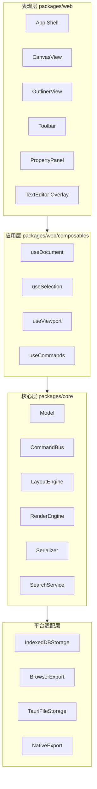
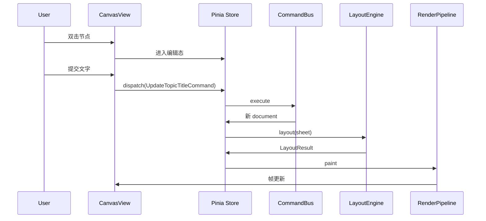

# MyMind 技术设计文档

> 版本：v1.6-draft  
> 更新日期：2026-07-17  
> 状态：架构基线

---

## 1. 设计目标

1. **结构无关的数据模型**：九种结构共享 Topic 树，切换结构零数据损失
2. **平台无关的核心层**：`@mymind/core` 不依赖 Vue/DOM，可复用于 Web 与 Tauri
3. **可扩展的布局引擎**：`LayoutRegistry` 插件化注册，每种结构独立实现
4. **高性能渲染**：Canvas 2D 主渲染 + DOM 浮层编辑，支撑 2000+ 节点
5. **可逆编辑**：命令模式 + 不可变状态，完整撤销/重做

---

## 2. 技术栈

| 层级 | 技术 | 版本要求 |
|------|------|----------|
| 语言 | TypeScript | ^5.4 |
| 包管理 | pnpm workspaces | ^9 |
| 前端框架 | **Vue 3**（Composition API + `<script setup>`） | ^3.5 |
| 构建 | Vite + `@vitejs/plugin-vue` | ^6 |
| 状态管理 | **Pinia** | ^3 |
| 组合式工具 | **VueUse**（`@vueuse/core`） | ^11 |
| 渲染 | Canvas 2D API | 原生 |
| 文本测量 | Canvas measureText / OffscreenCanvas | 原生 |
| 几何辅助 | 自研 + elkjs（部分结构） | ^0.9 |
| 国际化 | **vue-i18n** | ^10 |
| 桌面壳 | Tauri | ^2（v1.0） |
| 单元测试 | Vitest + `@vue/test-utils` | ^3 |
| E2E | Playwright | ^1（可选） |

### 2.1 选用 Vue 3 的说明

| 考量 | 说明 |
|------|------|
| 与 core 解耦 | 导图引擎在 `packages/core`，Vue 仅用于 `packages/web` 表现层 |
| Canvas 场景 | 主渲染走 Canvas，Vue 负责面板/工具栏/浮层编辑，无大量 DOM 节点压力 |
| 状态模型 | 文档状态经 `CommandBus` 管理，Pinia 只做 UI 状态与 document 镜像 |
| 组合式 API | `composables/` 封装画布、选区、命令，逻辑集中、便于测试 |
| Tauri 兼容 | Vite 构建产物与 Tauri WebView 无缝集成 |

### 2.2 不选用的方案及原因

| 方案 | 原因 |
|------|------|
| React | 团队倾向 Vue 3；架构上两者均可，本项目选定 Vue |
| 纯 SVG 渲染 | 2000+ 节点时 DOM 节点过多，性能不足 |
| react-flow / G6 / Vue Flow 直接套用 | 面向流程图/一般图，不支持 XMind 九种结构的组合语义 |
| Electron | 可用但包体积大；优先 Tauri |
| 服务端渲染 | 本地优先工具，无需 SSR |
| Vuex | 已过时，Pinia 为官方推荐 |

---

## 3. 系统架构



### 3.1 模块依赖规则

```
packages/core     → 零外部 UI 依赖
packages/web      → 依赖 core
packages/desktop  → 依赖 web + Tauri API
```

**禁止**：`core` 引用 `web` 或 `vue`。

---

## 4. Monorepo 目录结构

```
mymind/
├── docs/                           # 项目文档
├── packages/
│   ├── core/                       # 核心引擎
│   │   ├── src/
│   │   │   ├── model/              # 数据模型与工厂函数
│   │   │   ├── commands/           # 命令定义与 CommandBus
│   │   │   ├── layout/             # 布局引擎
│   │   │   │   ├── types.ts
│   │   │   │   ├── registry.ts
│   │   │   │   ├── measure.ts      # 文本/节点尺寸测量
│   │   │   │   ├── mindmap.ts
│   │   │   │   ├── logic-chart.ts
│   │   │   │   ├── tree-chart.ts
│   │   │   │   ├── org-chart.ts
│   │   │   │   ├── timeline.ts
│   │   │   │   ├── fishbone.ts
│   │   │   │   ├── matrix.ts
│   │   │   │   ├── brace-map.ts
│   │   │   │   └── tree-table.ts
│   │   │   ├── render/             # 渲染指令生成
│   │   │   │   ├── pipeline.ts
│   │   │   │   ├── draw-topic.ts
│   │   │   │   ├── draw-edge.ts
│   │   │   │   ├── draw-shapes.ts
│   │   │   │   └── hit-test.ts
│   │   │   ├── io/                 # 序列化、导入导出
│   │   │   ├── search/             # 搜索服务
│   │   │   ├── theme/              # 主题解析
│   │   │   └── index.ts
│   │   ├── package.json
│   │   └── tsconfig.json
│   │
│   ├── web/                        # Vue 3 Web 应用
│   │   ├── src/
│   │   │   ├── components/         # Vue SFC（.vue）
│   │   │   │   ├── canvas/
│   │   │   │   ├── outliner/
│   │   │   │   ├── toolbar/
│   │   │   │   ├── property-panel/
│   │   │   │   └── text-editor/
│   │   │   ├── composables/        # useDocument、useViewport 等
│   │   │   ├── stores/             # Pinia stores
│   │   │   ├── adapters/           # Web 平台 Storage/Export 实现
│   │   │   ├── i18n/
│   │   │   ├── App.vue
│   │   │   └── main.ts
│   │   ├── index.html
│   │   ├── package.json
│   │   └── vite.config.ts
│   │
│   └── desktop/                    # Tauri 桌面（v1.0）
│       ├── src-tauri/
│       └── package.json
│
├── pnpm-workspace.yaml
├── package.json
├── tsconfig.base.json
└── README.md
```

---

## 5. 数据模型

### 5.1 文档根结构

```typescript
/** 文件格式版本，用于迁移 */
const FORMAT_VERSION = 1;

interface MindMapDocument {
  formatVersion: number;
  id: string;
  title: string;
  createdAt: string;       // ISO 8601
  modifiedAt: string;
  sheets: Sheet[];
  themeId: string;
  settings: DocumentSettings;
}

interface DocumentSettings {
  autoSave: boolean;
  autoSaveIntervalMs: number;
  locale: 'zh-CN' | 'en-US';
}
```

### 5.2 Sheet

```typescript
type StructureType =
  | 'mindmap'
  | 'logic-chart'
  | 'tree-chart'
  | 'org-chart'
  | 'timeline'
  | 'fishbone'
  | 'matrix'
  | 'brace-map'
  | 'tree-table';

interface Sheet {
  id: string;
  title: string;
  structure: StructureType;
  structureOptions: StructureOptions;
  rootTopic: Topic;
  relationships: Relationship[];
  boundaries: Boundary[];
  summaries: Summary[];
  zones: Zone[];
  floatingTopics: Topic[];
  /** 贴纸 / 插画等画布装饰（EL-022/023） */
  decorations: CanvasDecoration[];
  comments: Comment[];              // CM-001，主题级评论，topicId 关联
  canvasSettings: CanvasSettings;   // PP-C01–PP-C07
  pitchSettings: PitchSettings;     // PP-P01–PP-P06
}

/** 画布 Tab 设置，对应功能规格 §6.3.3 */
interface CanvasSettings {
  backgroundColor: string;
  backgroundPattern: 'solid' | 'grid' | 'dots';
  globalFontFamily?: string;
  coloredBranch: boolean;           // PP-C04 彩虹分支
  themeId: string;                  // PP-C05
  handDrawn: boolean;               // PP-C06
  aspectGuide?: 'none' | 'a4' | 'a3' | '16:9' | '4:3' | '1:1'; // PP-C07
}

/** 演说 Tab 设置，对应功能规格 §6.3.2 */
interface PitchSettings {
  slides: PitchSlide[];
}

interface PitchSlide {
  id: string;
  topicId: string;                  // 关联演示主题
  order: number;
  backgroundColor?: string;
  transition?: 'none' | 'fade' | 'zoom';
}
```

### 5.3 StructureOptions（可辨识联合类型）

```typescript
type StructureOptions =
  | { type: 'mindmap'; balanced: boolean; direction?: 'auto' | 'left' | 'right' }
  | {
      type: 'logic-chart';
      direction: 'left' | 'right';
      lineStyle?: 'curve' | 'polyline';
      nodeDisplay?: 'box' | 'underline' | 'mixed';
      groupLeaves?: 'none' | 'brace';
      rootDisplay?: 'box' | 'underline';
    }
  | { type: 'tree-chart'; direction: 'top-down' | 'bottom-up' }
  | { type: 'org-chart'; compact: boolean }
  | { type: 'timeline'; axis: 'horizontal' | 'vertical'; alternate: boolean; showScale: boolean }
  | { type: 'fishbone'; headPosition: 'left' | 'right'; branchAngle: number }
  | { type: 'matrix'; rows: number; cols: number; titles: string[]; assignMode: 'auto' | 'manual' }
  | { type: 'brace-map'; braceSide: 'left' | 'right'; partPosition?: 'same' | 'opposite' }
  | { type: 'tree-table'; columns: TreeTableColumn[]; showTreeLine: boolean };

interface TreeTableColumn {
  id: string;
  field: 'title' | 'note' | 'labels' | 'markers' | 'task';
  width: number;
  label: string;
}
```

### 5.4 Topic

```typescript
interface Topic {
  id: string;
  /** 纯文本标题，搜索/大纲/OPML 用；与 titleRich 同步 */
  title: string;
  /** TE-002 富文本标题；undefined 时 title 即为显示内容 */
  titleRich?: InlineRun[];
  children: Topic[];
  collapsed: boolean;

  /** 样式：undefined 表示跟随主题 */
  style?: TopicStyle;

  note?: string;                    // HTML 或 Markdown 子集
  labels: Label[];
  markers: string[];                // marker icon id
  image?: ImageAttachment;
  hyperlink?: Hyperlink;
  attachments: FileAttachment[];
  task?: TaskInfo;

  /** 矩阵结构：手动指定象限索引（0-based） */
  quadrantIndex?: number;

  /** 时间轴：ISO 日期字符串 */
  date?: string;

  /** 标注（气泡便签，画布可见短文本） */
  callout?: Callout;

  /** 待办清单 */
  todos?: TodoItem[];

  /** 方程（LaTeX 源文本） */
  equation?: string;

  /** 元数据 */
  createdAt: string;
  modifiedAt: string;
}

/** TE-002：节点标题行内样式片段 */
interface InlineRun {
  text: string;
  bold?: boolean;
  italic?: boolean;
  underline?: boolean;
  color?: string;
  fontSize?: number;
}

interface TopicStyle {
  shape: 'rounded' | 'rectangle' | 'ellipse' | 'diamond' | 'none';
  fillColor?: string;
  borderColor?: string;
  borderWidth?: number;
  borderDash?: number[];            // 虚线 pattern，空=实线
  fontFamily?: string;
  fontSize?: number;
  fontColor?: string;
  fontWeight?: 'normal' | 'bold' | 'light' | 'medium';
  fontStyle?: 'normal' | 'italic';
  textDecoration?: 'none' | 'underline' | 'line-through';
  textTransform?: 'none' | 'uppercase' | 'lowercase' | 'capitalize';
  textAlign?: 'left' | 'center' | 'right';
  width?: number;                   // 固定宽度 px，undefined = 适合（自适应）
  widthMode?: 'auto' | 'fixed';      // 「适合」按钮设为 auto
}

interface Label {
  id: string;
  text: string;
  color: string;
}

interface Hyperlink {
  type: 'url' | 'topic' | 'file' | 'folder';
  target: string;                   // URL / topicId / filePath / folderPath
  title?: string;                   // 显示名称
}

interface Callout {
  id: string;
  text: string;
  /** 相对主题锚点的偏移 */
  offset: { x: number; y: number };
  showLeader: boolean;              // 是否显示引线
  style?: {
    backgroundColor: string;
    borderColor: string;
    fontSize: number;
  };
}

interface TodoItem {
  id: string;
  text: string;
  checked: boolean;
  order: number;
}

interface Comment {
  id: string;
  topicId: string;
  author?: string;                  // v2.0 协作
  content: string;
  createdAt: string;
  replies?: Comment[];
}

interface TaskInfo {
  startDate?: string;
  endDate?: string;
  progress: number;                 // 0-100
  priority: 'none' | 'low' | 'medium' | 'high';
  assignee?: string;
}

interface ImageAttachment {
  src: string;                      // base64 或 blob URL 或相对路径
  width: number;
  height: number;
}

interface FileAttachment {
  id: string;
  name: string;
  mimeType: string;
  size: number;
  data?: string;                    // base64（≤2MB 小文件内嵌）
  blobRef?: string;                 // IndexedDB blob store key（大文件）
  path?: string;                    // 桌面端文件路径引用
}
```

### 5.5 结构元素

```typescript
/** 概要：包裹同级连续分支的弧形线 + 概要主题 */
interface Summary {
  id: string;
  parentTopicId: string;            // 所属父主题
  /** 被概要包裹的子主题 id，按兄弟顺序连续 */
  topicRange: [string, string];     // [起始子主题 id, 结束子主题 id]
  /** 概要主题（独立节点，存于 floatingTopics 或内嵌） */
  summaryTopicId: string;
  style?: SummaryStyle;
}

interface SummaryStyle {
  lineColor: string;
  lineWidth: number;
  lineType: 'arc';                  // 初版仅弧形
}

interface Relationship {
  id: string;
  fromTopicId: string;
  toTopicId: string;
  title?: string;
  /** 曲线模式下的控制点（世界坐标），undefined 则自动计算 */
  controlPoints?: Point[];
  style?: EdgeStyle;
}

interface Boundary {
  id: string;
  title?: string;
  topicIds: string[];               // 包含的主题 id
  /** 相对包围盒的内边距 */
  padding?: { top: number; right: number; bottom: number; left: number };
  style?: BoundaryStyle;
}

interface EdgeStyle {
  lineType: 'curve' | 'polyline' | 'straight';
  color: string;
  width: number;
  dash?: number[];
  arrowStart: boolean;
  arrowEnd: boolean;
}

interface BoundaryStyle {
  fillColor: string;
  borderColor: string;
  borderWidth: number;
  borderDash?: number[];
  opacity: number;
  borderRadius: number;
}

/** 专区：独立模块化画布容器 */
interface Zone {
  id: string;
  title?: string;
  /** 包含的主题根 id 列表（通常为自由主题子树的根） */
  topicIds: string[];
  x: number;
  y: number;
  width: number;
  height: number;
  collapsed: boolean;
  showTitle: boolean;
  /** 预设比例：free | a4 | a3 | ratio-16-9 | ratio-4-3 | ratio-1-1 */
  aspectPreset?: string;
  style?: ZoneStyle;
}

interface ZoneStyle {
  backgroundColor: string;
  borderColor: string;
  borderWidth: number;
  opacity: number;
}
```

### 5.6 主题

```typescript
interface Theme {
  id: string;
  name: string;
  colors: {
    background: string;
    centralTopic: TopicStyle;
    mainTopic: TopicStyle;
    subTopic: TopicStyle;
    floatingTopic: TopicStyle;
    branchColors: string[];         // 彩虹分支色板
  };
  edge: EdgeStyle;
  fontFamily: string;
  handDrawn: boolean;
}
```

**主题作用域**（对应 TH-004）：

| 层级 | 字段 | 行为 |
|------|------|------|
| 文档默认 | `MindMapDocument.themeId` | 新建 Sheet 的初始主题 |
| Sheet 覆盖 | `Sheet.canvasSettings.themeId` | 当前 Sheet 实际使用的主题 |
| 切换操作 | `UpdateThemeCommand` | 更新**当前 Sheet** 的 `canvasSettings.themeId`，不修改其他 Sheet |

### 5.8 画布装饰（贴纸 / 插画）

```typescript
/** 独立于 Topic 树的画布装饰元素（EL-022/023） */
interface CanvasDecoration {
  id: string;
  type: 'sticker' | 'illustration';
  assetId: string;                  // 内置素材库 id
  x: number;
  y: number;
  width: number;
  height: number;
  rotation: number;                 // 弧度
  zIndex: number;
  /** 可选：附着某主题，主题移动时跟随 */
  attachedTopicId?: string;
}

/** 内置素材元数据（只读，不写入 .mymind） */
interface DecorationAsset {
  id: string;
  type: 'sticker' | 'illustration';
  category: string;
  src: string;                      // 打包资源路径
  defaultWidth: number;
  defaultHeight: number;
}
```

布局：`decorations` 不参与树布局；命中检测与选区独立处理；导出 PNG/SVG 时按 `zIndex` 叠加绘制。

### 5.9 富文本标题（TE-002）

| 场景 | 策略 |
|------|------|
| 存储 | `titleRich: InlineRun[]`；`title` 为 `runsToPlain(titleRich)` 缓存 |
| 编辑 | `TextEditor` 浮层用 `contenteditable`，编辑结束序列化为 `InlineRun[]` |
| 测量 | `TextMeasurer` 逐 run 测量宽度后累加/折行 |
| 命令 | `UpdateTopicTitleCommand` 同时更新 `title` + `titleRich`；支持 `canMerge` 连续输入 |
| 导出 | PNG/SVG 逐 run 绘制样式；Markdown/OPML 仅输出 `title` 纯文本 |
| 兼容 | 旧文件无 `titleRich` 时，将 `title` 视为单 run 纯文本 |

```typescript
function runsToPlain(runs: InlineRun[]): string {
  return runs.map((r) => r.text).join('');
}
```

### 5.10 ID 生成

```typescript
/** 使用 nanoid 或 uuid v4，全局唯一 */
type TopicId = string;
```

---

## 6. 布局引擎设计

### 6.1 核心接口

```typescript
/** 测量函数：根据 Topic 内容计算节点包围盒 */
type MeasureFn = (topic: Topic, depth: number) => Size;

interface Size {
  width: number;
  height: number;
}

interface LayoutNode {
  id: string;
  x: number;
  y: number;
  width: number;
  height: number;
  depth: number;
  angle?: number;           // 鱼骨图等需要
  rowIndex?: number;        // 树形表格
  colIndex?: number;        // 矩阵
  hidden?: boolean;         // 折叠的子树
}

interface LayoutEdge {
  id: string;
  from: string;
  to: string;
  points: Point[];          // 折线/曲线控制点
  type: 'tree' | 'relationship' | 'summary';
}

interface ExtraShape {
  id: string;
  type: 'brace' | 'matrix-cell' | 'timeline-axis' | 'boundary' | 'summary';
  bounds: Rect;
  path?: string;              // SVG path d（括号等）
  label?: string;
  style: Record<string, unknown>;
}

interface LayoutResult {
  nodes: Map<string, LayoutNode>;
  edges: LayoutEdge[];
  extraShapes: ExtraShape[];
  bounds: Rect;               // 全部内容包围盒
}

interface LayoutStrategy {
  readonly type: StructureType;
  layout(
    root: Topic,
    options: StructureOptions,
    measure: MeasureFn,
    floatingTopics?: Topic[]
  ): LayoutResult;
}
```

### 6.2 布局注册表

```typescript
class LayoutRegistry {
  private strategies = new Map<StructureType, LayoutStrategy>();

  register(strategy: LayoutStrategy): void;
  get(type: StructureType): LayoutStrategy;
  layout(sheet: Sheet, measure: MeasureFn): LayoutResult;
}
```

### 6.3 各结构算法概要

#### 6.3.1 思维导图（mindmap）

```
算法：Reingold-Tilford 变种 + 径向/左右分配
1. 后序遍历计算每个子树宽度（含间距）
2. 根节点置于 (0, 0)
3. 一级子节点按 balanced 分左右组
4. 各侧递归放置，y 由子树高度决定，x 由深度决定
5. 连线：三次贝塞尔曲线
复杂度：O(n)
```

#### 6.3.2 逻辑图（logic-chart）

```
算法：水平层次布局 + 样式变体
1. 后序遍历计算子树高度
2. x = depth * levelGap（direction 控制左右）
3. y = 子树内垂直居中
4. lineStyle：curve（水平贝塞尔）或 polyline（正交折线）
5. nodeDisplay：box / underline / mixed（有嵌套子树用方框，叶组用下划线）
6. groupLeaves=brace：叶级兄弟外侧加括号 extraShape
7. rootDisplay：根节点 box 或 underline
```

#### 6.3.3 树状图（tree-chart）

```
算法：自上而下 Reingold-Tilford；bottom-up 时垂直翻转
1. 后序遍历计算子树宽度
2. y = depth * levelGap（top-down）
3. x = 子树内水平居中
4. direction=bottom-up：对 nodes/edges 做垂直翻转，根在下
5. 连线：垂直到水平到垂直
```

#### 6.3.4 组织结构图（org-chart）

```
算法：自上而下分层居中（层间距大于树状图）
1. 后序计算子树宽度；同层兄弟水平排布并居中于父节点下
2. y 层间距默认 LEVEL_GAP（树状图用 V_GAP，视觉更紧凑）
3. 连线：垂直→水平→垂直正交折线
4. compact 模式：levelGap / 2，并略减水平间距
```

#### 6.3.5 时间轴（timeline）

```
算法：主轴 + 交替事件 + 多级沿轴树状展开
1. 主轴为水平/垂直线（extraShape，由 axis 决定）
2. 一级子节点按 date（ISO）升序排列；无 date 的保持相对顺序置于末尾
3. alternate=true 时奇偶事件在主轴两侧
4. 二级及以下沿主轴前进方向呈树状展开（水平→向右 / 垂直→向下）：
   父节点在子树带内居中，同级在垂直于主轴的方向堆叠；事件间距按整棵子树占位
```

#### 6.3.6 鱼骨图（fishbone）

```
算法：主干 + 斜向主骨 + 水平刺骨（石川 / XMind）
1. 根节点在鱼头（默认 headPosition=right）
2. 主干线沿水平方向
3. 一级子节点（主因类别）落在斜骨末端，带方框
4. 二级原因以水平下划线刺骨挂在斜骨上（朝远离鱼头方向）；三级及以下继续水平展开
5. extraShape：主干线；depth≥2 节点 display=underline
```

#### 6.3.7 矩阵图（matrix）

```
算法：网格分配
1. 根节点居中上方（或跨列标题）
2. 将 grid 分为 rows×cols 单元
3. assignMode=auto：一级子节点按顺序填入象限
4. assignMode=manual：读取 topic.quadrantIndex
5. 象限内一级主题纵向堆叠；二级及以下递归缩进堆叠（整棵子树）
6. extraShape：单元格边框、象限标题
```

#### 6.3.8 括号图（brace-map）

```
算法：侧向括号（支持嵌套）
1. braceSide=left|right：大括号相对根/整组的所在侧（默认 right → 根在左、部分在右）
2. partPosition=opposite：根与部分分居括号两侧；same：与根同列缩进，括号在组的 braceSide 外侧
3. extraShape：大括号贝塞尔路径连接
4. 二级以下递归布局并生成嵌套括号
```

#### 6.3.9 树形表格（tree-table）

```
算法：行映射
1. DFS 遍历生成行列表
2. 每行：depth 决定缩进；columns 决定列宽与字段（title/note/labels/markers/task）
3. 表头与非 title 列以 table-cell extraShape 渲染
4. 节点位置按行高 × 行号计算
5. 连线：缩进竖线 + 水平线（showTreeLine）
```

### 6.4 布局缓存与增量更新

```typescript
interface LayoutCache {
  sheetId: string;
  structureHash: string;    // structure + options 哈希
  contentHash: string;      // topic 树内容哈希
  result: LayoutResult;
}

/** 增量策略 */
// 1. 仅编辑文字：重新 measure 受影响子树 → 局部 relayout
// 2. 增删节点：重新 layout 整棵树（<100ms 可接受）
// 3. 切换结构：全量 relayout
// 4. 拖拽视口：不触发 layout
```

### 6.5 尺寸测量

```typescript
class TextMeasurer {
  private canvas: OffscreenCanvas;
  private ctx: OffscreenCanvasRenderingContext2D;

  measureTopic(topic: Topic, style: TopicStyle, theme: Theme): Size {
    // 1. 计算标题文字宽度（考虑换行宽度限制）
    // 2. 叠加 markers、labels 高度
    // 3. 叠加 image 尺寸
    // 4. 加 padding
  }
}
```

### 6.6 结构元素布局（概要 / 外框 / 关系）

结构元素在 **树布局完成之后** 计算，写入 `LayoutResult.edges` 与 `LayoutResult.extraShapes`。

#### 6.6.1 概要布局

```typescript
function layoutSummary(
  summary: Summary,
  nodes: Map<string, LayoutNode>,
  structure: StructureType
): { arc: LayoutEdge; summaryNode: LayoutNode } {
  // 1. 解析 topicRange，取范围内所有同级子节点
  // 2. 计算这些节点在「背离父节点」一侧的外包络
  // 3. 生成弧形贝塞尔路径（edges, type: 'summary'）
  // 4. 弧线末端放置 summaryTopic 节点坐标
  // 5. 思维导图：左右侧分支概要弧方向不同，需根据父节点位置判断
}
```

| 结构 | 概要弧线方向 |
|------|-------------|
| mindmap | 子节点远离中心一侧 |
| logic-chart | 子节点远离父节点连线一侧 |
| tree-chart / org-chart | 子节点水平外侧 |
| 其他 | v0.2 暂不支持，保留数据但不渲染 |

#### 6.6.2 外框布局

```typescript
function layoutBoundary(
  boundary: Boundary,
  nodes: Map<string, LayoutNode>
): ExtraShape {
  // 1. 合并 boundary.topicIds 对应节点的 bounds
  // 2. 叠加 padding（默认 16px）
  // 3. 生成 extraShape（type: 'boundary'）
  // 4. 标题绘制在 bounds 顶部居中
}
```

外框 **不参与** 树布局，不推开其他节点；与 XMind 一致，允许与主题重叠时由用户手动调整主题位置。

#### 6.6.3 关系布局

```typescript
function layoutRelationship(
  rel: Relationship,
  nodes: Map<string, LayoutNode>
): LayoutEdge {
  // 1. 取 from/to 节点中心或边缘锚点（取最近的一对边缘点）
  // 2. 根据 lineType 生成路径点：
  //    - straight: [fromAnchor, toAnchor]
  //    - polyline: 正交折线（1 个拐点）
  //    - curve: 二次贝塞尔，controlPoints 优先，否则自动
  // 3. 文字标签置于路径中点
  // 4. edges, type: 'relationship'
}
```

#### 6.6.5 专区布局

```typescript
function layoutZone(zone: Zone, nodes: Map<string, LayoutNode>): ExtraShape {
  // 1. 合并 zone.topicIds 对应节点 bounds
  // 2. 叠加 zone 的 x/y/width/height（用户手动调整后优先）
  // 3. collapsed 时仅渲染标题条
  // 4. extraShape type: 'zone'
}
```

#### 6.6.6 标注布局

```typescript
function layoutCallout(
  topicId: string,
  callout: Callout,
  node: LayoutNode
): ExtraShape {
  // 1. 气泡位置 = node 锚点 + callout.offset
  // 2. showLeader 时绘制折线引线到主题边缘
  // 3. extraShape type: 'callout'
}
```

#### 6.6.4 结构元素增量更新

| 变更 | 重算范围 |
|------|----------|
| 主题移动/增删 | 受影响的外框 bounds、关系锚点、概要弧线路径 |
| 仅改关系样式 | 不重算布局，只重绘 |
| 折叠分支 | 隐藏范围内概要弧；外框 bounds 缩小或隐藏 |
| 切换结构 | 全量重算树 + 结构元素 |

---

## 7. 渲染引擎设计

### 7.1 渲染管线

```typescript
interface RenderFrame {
  layers: RenderLayer[];
  bounds: Rect;
}

type RenderLayer =
  | { type: 'background'; color: string }
  | { type: 'extra-shapes'; shapes: ExtraShape[] }
  | { type: 'edges'; edges: LayoutEdge[]; style: EdgeStyle }
  | { type: 'topics'; nodes: LayoutNode[]; topics: Map<string, Topic> }
  | { type: 'boundaries'; boundaries: Boundary[] }
  | { type: 'relationships'; relationships: Relationship[] }
  | { type: 'selection'; selectedIds: string[] }
  | { type: 'overlay'; dragPreview?: LayoutNode };

class RenderPipeline {
  buildFrame(
    sheet: Sheet,
    layout: LayoutResult,
    theme: Theme,
    selection: string[]
  ): RenderFrame;

  paint(ctx: CanvasRenderingContext2D, frame: RenderFrame, viewport: Viewport): void;
}
```

### 7.2 视口

```typescript
interface Viewport {
  x: number;          // 平移
  y: number;
  zoom: number;       // 1 = 100%
  width: number;      // 画布像素宽
  height: number;
}

/** 坐标变换 */
function worldToScreen(point: Point, viewport: Viewport): Point;
function screenToWorld(point: Point, viewport: Viewport): Point;
```

### 7.3 命中检测

```typescript
class HitTester {
  /** 按层级从上到下检测 */
  hitTest(point: Point, layout: LayoutResult, topics: Map<string, Topic>): HitResult | null;
}

type HitResult =
  | { type: 'topic'; id: string }
  | { type: 'relationship'; id: string }
  | { type: 'boundary'; id: string }
  | { type: 'summary'; id: string }      // 概要弧线或概要主题
  | { type: 'collapse-button'; topicId: string }
  | { type: 'canvas' };
```

### 7.4 文字编辑浮层

```
流程：
1. 双击节点 → 计算 screen 坐标 → 在 DOM 层放置 contenteditable div
2. 编辑中 Canvas 对应节点可显示半透明或隐藏
3. 提交 → 发出 UpdateTopicTitleCommand → 移除浮层 → relayout → repaint
```

### 7.5 绘制优化

| 策略 | 说明 |
|------|------|
| 视口裁剪 | 只绘制可见区域内节点 |
| 缓存静态层 | 无变化时将背景+连线缓存到离屏 Canvas |
| requestAnimationFrame | 缩放/平移时合并重绘 |
| 分层 Canvas | 静态层 + 动态层（选中、拖拽） |

### 7.6 结构元素渲染

绘制顺序（由底到顶）：

```
1. 外框填充与边框（extraShapes: boundary）
2. 树形连线（edges: tree）
3. 概要弧线（edges: summary）
4. 关系连线（edges: relationship）
5. 主题节点
6. 概要主题节点（summaryTopic，样式同 floatingTopic）
7. 选中态：外框/关系/概要弧线高亮
```

| 元素 | 绘制要点 |
|------|----------|
| 概要弧线 | `ctx.arc` 或三次贝塞尔；线宽/颜色取自 `SummaryStyle` |
| 概要主题 | 与普通主题相同管线，通过 `summaryTopicId` 关联 |
| 外框 | 圆角矩形 + 顶部标题文字；`borderRadius` 默认 8px |
| 关系线 | 路径 + 箭头（三角形 marker）+ 中点文字背景块 |

---

## 8. 命令系统（Undo/Redo）

### 8.1 Command 接口

```typescript
interface Command {
  readonly name: string;
  execute(state: MindMapDocument): MindMapDocument;
  undo(state: MindMapDocument): MindMapDocument;
  /** 可选：合并连续同类命令（如连续输入文字） */
  canMerge?(other: Command): boolean;
  merge?(other: Command): Command;
}

class CommandBus {
  private undoStack: Command[] = [];
  private redoStack: Command[] = [];
  private maxStackSize = 100;

  dispatch(command: Command): void;
  undo(): void;
  redo(): void;
  canUndo(): boolean;
  canRedo(): boolean;
}
```

### 8.2 命令清单

| 命令 | 说明 |
|------|------|
| `AddTopicCommand` | 添加子/同级节点 |
| `InsertParentTopicCommand` | 在当前节点上方插入父级（ED-004，P2） |
| `DeleteTopicCommand` | 删除节点子树 |
| `UpdateTopicTitleCommand` | 更新标题 |
| `UpdateTopicStyleCommand` | 更新样式 |
| `MoveTopicCommand` | 改变父节点或排序 |
| `AddFloatingTopicCommand` / `UpdateFloatingTopicCommand` / `DeleteFloatingTopicCommand` | 自由主题 CRUD（ED-006） |
| `CopyTopicsCommand` | 将选中子树序列化到剪贴板（ED-011） |
| `PasteTopicsCommand` | 从剪贴板粘贴子树，支持跨 Sheet（ED-011） |
| `ToggleCollapseCommand` | 折叠/展开 |
| `UpdateSheetStructureCommand` | 切换结构 |
| `AddSummaryCommand` | 添加概要（含创建 summaryTopic） |
| `DeleteSummaryCommand` | 删除概要及 summaryTopic |
| `UpdateSummaryStyleCommand` | 更新概要弧线样式 |
| `AddBoundaryCommand` | 添加外框 |
| `UpdateBoundaryCommand` | 更新外框标题、包含主题、样式 |
| `DeleteBoundaryCommand` | 删除外框 |
| `AddRelationshipCommand` | 添加关系 |
| `UpdateRelationshipCommand` | 更新关系文字、样式、控制点 |
| `DeleteRelationshipCommand` | 删除关系 |
| `AddCalloutCommand` / `UpdateCalloutCommand` / `DeleteCalloutCommand` | 标注 |
| `AddTodoItemCommand` / `ToggleTodoCommand` / `DeleteTodoCommand` | 待办 |
| `AddZoneCommand` / `UpdateZoneCommand` / `DeleteZoneCommand` | 专区 |
| `AddCommentCommand` / `UpdateCommentCommand` / `DeleteCommentCommand` | 本地评论 CRUD（CM-001/002，v1.0 P3）；协作能力见 CM-003–005 |
| `UpdateEquationCommand` | 方程 |
| `AddDecorationCommand` / `UpdateDecorationCommand` / `DeleteDecorationCommand` | 贴纸/插画（EL-022/023） |
| `UpdateCanvasSettingsCommand` | 画布 Tab 设置（PP-C01–C07） |
| `UpdatePitchSettingsCommand` | 演说 Tab 帧列表（PP-P01–P06） |
| `FormatPainterCommand` | 格式刷：复制样式到目标主题（TB-007） |
| `AddLabelCommand` / `DeleteLabelCommand` | 标签（EL-002） |
| `AddMarkerCommand` / `DeleteMarkerCommand` | 标记（EL-003） |
| `UpdateNoteCommand` | 备注（EL-001，TB-004 笔记面板） |
| `UpdateThemeCommand` | 切换主题 |
| `AddSheetCommand` / `DeleteSheetCommand` | Sheet 管理 |

#### 8.2.1 剪贴板载荷（ED-011）

复制/粘贴不走系统 JSON 剪贴板明文暴露结构，使用带类型标识的载荷：

```typescript
/** 应用内剪贴板 + 系统剪贴板 text/plain 降级 */
interface ClipboardPayload {
  format: 'mymind/topics/v1';
  sourceSheetId: string;
  /** 深拷贝的子树根列表（含完整 children 子树） */
  topics: Topic[];
  /** 若复制范围关联的结构元素，一并携带并在粘贴时重映射 id */
  summaries?: Summary[];
  boundaries?: Boundary[];
}

function copyTopics(payload: ClipboardPayload): void;
function pasteTopics(
  doc: MindMapDocument,
  targetSheetId: string,
  targetParentId: string | null,  // null = 粘贴为自由主题根
  insertIndex?: number
): MindMapDocument;
```

粘贴时 **重新生成所有 Topic / 结构元素 id**，并重写 `parentTopicId`、`topicRange`、`topicIds` 等引用。跨 Sheet 粘贴时 `sourceSheetId` 仅作溯源，不限制目标 Sheet。

#### 8.2.2 自由主题（ED-006）

自由主题存于 `Sheet.floatingTopics`，不参与树布局主流程，坐标由 `Topic.position`（布局层扩展字段）或独立 `FloatingTopicLayout` 维护：

```typescript
interface FloatingTopic extends Topic {
  position: { x: number; y: number };
}
```

创建：`AddFloatingTopicCommand` 在点击坐标处插入根节点；拖拽移动走 `UpdateFloatingTopicCommand`。

### 8.3 状态管理（Pinia）

```typescript
// packages/web/src/stores/document.ts
import { defineStore } from 'pinia';
import { CommandBus, type Command, type MindMapDocument } from '@mymind/core';

export const useDocumentStore = defineStore('document', {
  state: () => ({
    document: null as MindMapDocument | null,
    activeSheetId: '',
    selection: [] as string[],
    selectedElement: null as
      | { type: 'summary' | 'boundary' | 'relationship'; id: string }
      | null,
    relationshipMode: null as { fromTopicId: string } | null,
    viewport: { x: 0, y: 0, zoom: 1, width: 0, height: 0 },
    layoutCache: null as LayoutCache | null,
    commandBus: new CommandBus(),
  }),

  actions: {
    dispatch(command: Command) {
      if (!this.document) return;
      this.document = this.commandBus.dispatch(command, this.document);
      this.layoutCache = null; // 触发 relayout
    },
    undo() { /* ... */ },
    redo() { /* ... */ },
  },
});
```

**分层原则**：

| 状态类型 | 存放位置 | 示例 |
|----------|----------|------|
| 文档业务数据 | `MindMapDocument`（经 CommandBus 变更） | Topic 树、Sheet |
| 全局 UI 状态 | Pinia `document` store | 选区、视口、编辑模式 |
| 组件局部状态 | `ref` / `shallowRef` | 面板展开、输入框焦点 |
| 画布渲染缓存 | composable 内 `shallowRef` | LayoutResult、离屏 Canvas |

```typescript
// packages/web/src/composables/useViewport.ts
import { useDocumentStore } from '@/stores/document';
import { useResizeObserver } from '@vueuse/core';

export function useViewport(canvasRef: Ref<HTMLCanvasElement | null>) {
  const store = useDocumentStore();
  // 缩放、平移、坐标变换
}
```

---

## 9. 文件 IO

### 9.1 存储适配器接口

```typescript
interface StorageAdapter {
  save(document: MindMapDocument): Promise<void>;
  load(id: string): Promise<MindMapDocument | null>;
  list(): Promise<DocumentMeta[]>;
  delete(id: string): Promise<void>;
}

interface DocumentMeta {
  id: string;
  title: string;
  modifiedAt: string;
  thumbnail?: string;     // base64 缩略图
}
```

### 9.2 Web 实现

```typescript
class IndexedDBStorage implements StorageAdapter {
  // IndexedDB object store: documents
}

class BrowserFileExport {
  downloadAsJson(doc: MindMapDocument): void;   // 触发 <a download>
  openJsonFile(): Promise<MindMapDocument>;     // <input type="file">
}
```

### 9.3 Tauri 实现（v1.0）

```typescript
class TauriFileStorage implements StorageAdapter {
  // 通过 Tauri fs API 读写 .mymind 文件
  // 支持文件关联、最近文件列表
}
```

### 9.4 文件格式

```json
{
  "formatVersion": 1,
  "id": "doc_abc123",
  "title": "我的思维导图",
  "createdAt": "2026-07-09T06:00:00.000Z",
  "modifiedAt": "2026-07-09T06:30:00.000Z",
  "themeId": "theme-default",
  "settings": {
    "autoSave": true,
    "autoSaveIntervalMs": 30000,
    "locale": "zh-CN"
  },
  "sheets": [ /* ... */ ]
}
```

**压缩**：大于 100KB 时可选 gzip（文件扩展名 `.mymind.gz` 或内嵌 `compressed: true` 标记）。

### 9.5 版本迁移

```typescript
interface Migration {
  fromVersion: number;
  toVersion: number;
  migrate(doc: unknown): MindMapDocument;
}

const migrations: Migration[] = [
  // v1 → v2 时添加
];
```

### 9.6 附件与大文件策略

| 规则 | 值 | 说明 |
|------|-----|------|
| 单附件内嵌上限 | 2 MB | 超过则 Web 端拒绝内嵌，提示用户 |
| 文档总大小建议 | ≤ 10 MB | 对应功能规格 NFR |
| 小文件 | `FileAttachment.data` | base64 内嵌于 JSON |
| 大文件 Web | IndexedDB Blob 侧表 | JSON 仅存 `blobRef` id |
| 大文件 Tauri | `FileAttachment.path` | 相对 `.mymind` 目录或绝对路径 |
| 图片 | `ImageAttachment.src` | 优先 blob URL；导出时内联 base64 |

```typescript
interface FileAttachment {
  id: string;
  name: string;
  mimeType: string;
  size: number;
  data?: string;                    // ≤2MB base64 内嵌
  blobRef?: string;                 // IndexedDB blob store key
  path?: string;                    // 桌面端文件路径引用
}
```

---

## 10. 导入导出设计

### 10.1 导出器接口

```typescript
interface Exporter {
  format: ExportFormat;
  export(doc: MindMapDocument, options: ExportOptions): Promise<Blob>;
}

type ExportFormat = 'png' | 'pdf' | 'svg' | 'markdown' | 'opml' | 'json' | 'docx' | 'xlsx' | 'pptx';
```

### 10.2 PNG 导出流程

```
1. 离屏 Canvas 渲染完整 LayoutResult（无视口裁剪）
2. 可选 2x/3x devicePixelRatio
3. canvas.toBlob('image/png')
```

### 10.3 SVG 导出

```
RenderPipeline 增加 SVG 后端：
- 节点 → <rect> + <foreignObject> 或 <text>
- 连线 → <path>
- 括号 → <path d="...">
```

### 10.4 Markdown 导出

```markdown
# 中心主题

## 主主题 1

### 子主题 1.1

- 标签: [重要]
- 备注: ...
```

### 10.5 OPML 导出

```xml
<opml version="2.0">
  <body>
    <outline text="中心主题">
      <outline text="主主题 1">...</outline>
    </outline>
  </body>
</opml>
```

### 10.6 导入器设计

```typescript
interface Importer {
  format: ImportFormat;
  import(source: ArrayBuffer | string, options?: ImportOptions): Promise<ImportResult>;
}

type ImportFormat = 'markdown' | 'opml' | 'xmind' | 'freemind' | 'plain-text' | 'json';

interface ImportOptions {
  /** 导入为新的 Sheet 还是替换当前 Sheet */
  target: 'new-sheet' | 'replace-sheet' | 'new-document';
  structure?: StructureType;        // 默认 mindmap
}

interface ImportResult {
  document?: MindMapDocument;
  sheet?: Sheet;
  warnings: string[];               // 不支持的元素提示
}
```

| 格式 | 实现 | 优先级 | 说明 |
|------|------|--------|------|
| JSON (`.mymind`) | `deserialize()` | v0.1 | 原生格式 |
| Markdown | 标题 `#` 层级 → Topic 树 | v0.3 | 仅结构，不含样式 |
| OPML | `<outline>` 递归解析 | v0.3 | 大纲交换 |
| XMind (`.xmind`) | ZIP → `content.json` / legacy XML | v1.0 | **只读**；映射 Topic/备注/标签；忽略 PRO 专有元素 |
| FreeMind (`.mm`) | XML 解析 | v1.0 | 基础节点树 |
| 纯文本缩进 | 空格/tab 推断层级 | v1.0 | 简易导入 |

**XMind 导入范围（v1.0）**：

- ✅ 节点标题、备注、标签、超链接、折叠状态
- ✅ 单 Sheet 思维导图结构
- ⚠️ 多 Sheet 取第一个；关系/外框/概要尽力映射
- ❌ 协作数据、AI 生成内容、加密文件

实现位置：`packages/core/src/io/importers/`；Web 通过 `<input type="file">` 调用。

### 10.7 PDF 导出

```
方案：离屏 Canvas 栅格化 → pdf-lib 嵌入 PNG 页面

1. 与 PNG 导出相同：渲染完整 LayoutResult 到离屏 Canvas
2. canvas.toBlob('image/png') 或 toDataURL
3. pdf-lib 创建单页 PDF，按内容尺寸设置 page size
4. 可选：多 Sheet 时每 Sheet 一页
5. 矢量 PDF（纯 path/text）列为 v1.0+ 优化项，初版接受位图 PDF
```

依赖：`pdf-lib`（纯 JS，无服务端）。演说模式导出 PDF 演说稿复用同一流程，按 Pitch 帧逐页渲染。

### 10.8 Office 导出（docx / xlsx）

| 格式 | 方案 | 版本 |
|------|------|------|
| docx | 大纲层级 → `docx` 库生成 heading 段落；内嵌 PNG 截图可选 | v1.0 |
| xlsx | 树形表格结构 DFS 展平为行；每列对应 `TreeTableColumn.field` | v1.0 |
| pptx | Pitch 帧逐页截图嵌入幻灯片 | v1.0+（P3） |

### 10.9 打印（PR-001–003）

打印复用 §10.7 PDF 渲染管线，差异在分页交互与输出通道。

| 功能 ID | 实现 | 版本 |
|---------|------|------|
| PR-001 打印预览 | `PrintPreview.vue` 弹层，按页显示缩略图 | v1.0 |
| PR-002 页面设置 | `PrintSettings`：纸张、方向、边距 | v1.0 |
| PR-003 多 Sheet 打印 | `printScope: 'current-sheet' \| 'all-sheets'` | v1.0（P3） |

```typescript
interface PrintSettings {
  paperSize: 'a4' | 'a3' | 'letter';
  orientation: 'portrait' | 'landscape';
  margins: { top: number; right: number; bottom: number; left: number }; // mm
  printScope: 'current-sheet' | 'all-sheets';
  fitToPage: boolean;           // 单 Sheet 超页时缩放至一页
}
```

**Web 端流程**：

```
1. 按 PrintSettings 计算可打印区域（mm → px）
2. 离屏 Canvas 渲染 LayoutResult，按页高分页（或 fitToPage 整体缩放）
3. 生成打印专用 DOM（每页 <div class="print-page">）或 pdf-lib Blob URL
4. window.print() + @media print CSS（隐藏工具栏/面板）
```

**Tauri 端（v1.0）**：调用系统打印对话框；可选 `tauri-plugin-printer` 或 WebView `window.print()`。

组件：`PrintPreview.vue`、`composables/usePrint.ts`（封装设置与分页计算）。

---

## 11. 搜索服务

```typescript
class SearchService {
  search(doc: MindMapDocument, query: string, options?: SearchOptions): SearchResult[];

  interface SearchResult {
    topicId: string;
    sheetId: string;
    field: 'title' | 'note' | 'label';
    snippet: string;
    score: number;
  }
}
```

---

## 12. Web 应用层设计

### 12.1 主界面布局

```
┌──────────────────────────────────────────────────────────────┐
│ 主工具栏：撤销/重做 │ 插入 │ 关系/外框/概要 │ …    [分享][大纲][演说][笔记][😊][▶面板] │
├──────────┬───────────────────────────────────────┬─────────────┤
│          │                                       │ [样式|演说|画布] │
│  大纲    │              Canvas 画布               │  预览        │
│  面板    │                                       │  形状/文本   │
│（可收起）│                                       │  结构        │
│          │                                       │             │
├──────────┴───────────────────────────────────────┴─────────────┤
│ [100%▼]  大纲                                    Sheet 标签页    │
└──────────────────────────────────────────────────────────────┘
```

### 12.2 核心组件（Vue SFC）

| 组件 | 文件 | 职责 |
|------|------|------|
| `CanvasView` | `components/canvas/CanvasView.vue` | `<canvas ref>` 挂载、指针事件、调度渲染 |
| `TextEditor` | `components/text-editor/TextEditor.vue` | DOM 浮层 `contenteditable` |
| `Outliner` | `components/outliner/Outliner.vue` | 大纲树 |
| `StructurePicker` | `components/property-panel/StructurePicker.vue` | 九种结构切换（PST-001） |
| `ThemePicker` | `components/property-panel/ThemePicker.vue` | 主题选择（PP-C05） |
| `PropertyPanel` | `components/property-panel/PropertyPanel.vue` | 右侧三 Tab 容器 |
| `StyleTab` | `components/property-panel/StyleTab.vue` | 形状、文本、结构 |
| `PitchTab` | `components/property-panel/PitchTab.vue` | 演说帧列表 |
| `CanvasTab` | `components/property-panel/CanvasTab.vue` | 画布背景与主题 |
| `TopBar` | `components/toolbar/TopBar.vue` | 分享、大纲、演说等（TB-001–006） |
| `NotesPanel` | `components/toolbar/NotesPanel.vue` | 备注侧栏（TB-004） |
| `MarkerPicker` | `components/toolbar/MarkerPicker.vue` | 标记选择（TB-005） |
| `DecorationPicker` | `components/toolbar/DecorationPicker.vue` | 贴纸/插画库（EL-022/023） |
| `FormatPainter` | `composables/useFormatPainter.ts` | 格式刷（TB-007） |
| `StatusBar` | `components/toolbar/StatusBar.vue` | 缩放、大纲入口 |
| `StructureElementToolbar` | `components/toolbar/StructureElementToolbar.vue` | 概要/外框/关系 |
| `InsertMenu` | `components/toolbar/InsertMenu.vue` | 「+ 插入」下拉 |
| `SheetTabs` | `components/toolbar/SheetTabs.vue` | 多画布标签 |
| `Toolbar` | `components/toolbar/Toolbar.vue` | 主工具栏 |
| `Minimap` | `components/canvas/Minimap.vue` | 缩略导航（v0.3） |
| `PrintPreview` | `components/export/PrintPreview.vue` | 打印预览与页面设置（PR-001/002） |

### 12.3 事件流



---

## 13. 桌面打包方案（Tauri v1.0）

### 13.1 集成方式

```
packages/desktop/
├── src-tauri/
│   ├── src/
│   │   ├── main.rs
│   │   ├── commands.rs     # 文件对话框、最近文件
│   │   └── menu.rs
│   ├── tauri.conf.json
│   └── Cargo.toml
└── package.json              # 指向前端构建产物
```

### 13.2 Tauri 自定义命令

| 命令 | 说明 |
|------|------|
| `open_file_dialog` | 打开 `.mymind` |
| `save_file_dialog` | 保存文件 |
| `read_file` / `write_file` | 文件读写 |
| `get_recent_files` | 最近文件 |
| `generate_thumbnail` | 导出缩略图 |

### 13.3 与 Web 代码复用

- 前端构建产物完全相同（`packages/web/dist`）
- 通过 `import.meta.env.TAURI` 判断平台，切换 `StorageAdapter`
- 桌面端启用原生菜单快捷键

---

## 14. 性能设计

### 14.1 目标与手段

| 目标 | 手段 |
|------|------|
| 2000 节点流畅 | 视口裁剪 + 离屏缓存 |
| 布局 < 100ms | 高效树算法，避免 O(n²) |
| 缩放 30fps | 缩放时只变换缓存位图 |
| 首屏 < 2s | Vite 代码分割，core 与 UI 分包 |

### 14.2 性能监控

```typescript
interface PerfMetrics {
  layoutMs: number;
  renderMs: number;
  nodeCount: number;
  visibleNodeCount: number;
}

// 开发模式下显示性能 overlay
```

---

## 15. 测试策略

### 15.1 单元测试（Vitest）

| 模块 | 测试重点 |
|------|----------|
| layout/* | 每种结构的节点坐标、包围盒计算 |
| commands/* | execute/undo 对称性 |
| serializer | 序列化往返一致性 |
| measure | 文字宽度计算 |

### 15.2 快照测试

- 每种结构固定输入 → 布局结果 snapshot
- 防止算法回归

### 15.3 E2E（Playwright，可选）

| 场景 | 验证 |
|------|------|
| 创建导图 | Tab 创建节点 |
| 结构切换 | 节点数不变 |
| 保存打开 | 数据一致 |
| 导出 PNG | 文件 > 0 字节 |

---

## 16. 安全设计

| 风险 | 对策 |
|------|------|
| 备注 XSS | DOMPurify 过滤 HTML |
| 恶意文件导入 | 限制文件大小；JSON schema 校验 |
| 本地路径泄露 | Web 端不暴露绝对路径 |

---

## 17. 国际化

```typescript
// packages/web/src/i18n/index.ts
import { createI18n } from 'vue-i18n';

export const i18n = createI18n({
  legacy: false,
  locale: 'zh-CN',
  messages: {
    'zh-CN': { /* ... */ },
    'en-US': { /* ... */ },
  },
});
```

在 `main.ts` 中 `app.use(i18n)`；组件内使用 `useI18n()`。

---

## 18. 开发里程碑与任务分解

> 与功能规格 §15 对齐：**4 阶段 × 4 周 = 16 周**。下表为各阶段核心产出，Week 1–8 为 v0.1–v0.2 最小闭环，Week 9–16 为 v0.3–v1.0。  
> **TDD 详细任务分解**（Sprint、测试用例、需求追溯矩阵）见 [TDD 开发规划](./TDD开发规划.md)。

### Phase 1：MVP — v0.1（Week 1–4）

| 任务 | 产出 |
|------|------|
| 初始化 monorepo | pnpm workspace + Vue 3 + Vite 可构建 |
| 数据模型 + CommandBus | `packages/core/model`、`commands` |
| MindMap + Logic + Tree 布局 | 3 种结构 |
| Canvas 视口 + 基础 UI | 可编辑思维导图 |
| IndexedDB + JSON 下载 | 保存/打开 |
| PNG 导出 | 基础导出 |
| 基础主题 3 套 | 主题切换（Sheet 级） |

### Phase 2：结构全覆盖 — v0.2（Week 5–8）

| 任务 | 产出 |
|------|------|
| 剩余 6 种布局 | 9 种全覆盖 |
| StructurePicker | 结构切换 |
| Summary / Boundary / Relationship | 结构元素 |
| Callout + 备注/标签/标记 | 节点元素 |
| 多 Sheet + 大纲视图 | Outliner |
| 复制/粘贴 + 自由主题 | `CopyTopicsCommand`、`AddFloatingTopicCommand` |
| 布局快照测试 | 回归保护 |

### Phase 3：专业体验 — v0.3（Week 9–12）

| 任务 | 产出 |
|------|------|
| Zone + To-do | 专区与待办 |
| 完整主题系统 | ≥10 套主题 |
| 富文本标题 + 图片/超链接 | TE-002、EL-004/005 |
| 分支聚焦 + 搜索 | SearchService |
| ZEN / Pitch 模式 | 视图模式 |
| PNG/SVG/PDF/Markdown/OPML 导出 | §10 导出完整 |

### Phase 4：正式版 — v1.0（Week 13–16）

| 任务 | 产出 |
|------|------|
| 方程 + 贴纸/插画 | KaTeX + CanvasDecoration |
| 完整导入 | Markdown/OPML/XMind/FreeMind |
| Tauri 集成 | 桌面版 |
| 模板库 | ≥20 内置模板 |
| 性能优化 | 2000 节点目标 |
| docx/xlsx 导出 | Office 导出 |
| 打印 | `PrintPreview` + `usePrint`（§10.9） |

---

## 19. 关键接口一览

```typescript
// packages/core 公共 API
export { createDocument, createTopic, createSheet } from './model';
export { CommandBus, type Command } from './commands';
export { LayoutRegistry, type LayoutResult } from './layout';
export { RenderPipeline, type Viewport } from './render';
export { serialize, deserialize, migrate } from './io';
export { importDocument, type Importer } from './io/importers';
export { SearchService } from './search';
export { getTheme, listThemes } from './theme';
```

---

## 20. 与功能特性规格同步对照

> 两份文档版本须保持一致（当前 **v1.6-draft**）。功能 ID 定义以《功能特性规格》为准，接口与组件以本文档为准。

### 20.1 同步状态总览

| 模块 | 功能规格章节 | 技术设计章节 | 状态 |
|------|-------------|-------------|------|
| 核心编辑 | §3.1–3.4 | §8 命令、§12 事件流 | ✅ 已同步 |
| 顶部/底部栏 | §3.6–3.7 | §12.1–12.2 TopBar/StatusBar | ✅ 已同步 |
| 九种结构 | §4 | §5.3、§6.3 布局 | ✅ 已同步 |
| 插入菜单 | §5.0 | §12.2 InsertMenu、§8 命令 | ✅ 已同步 |
| 结构元素 | §5.2 | §5.5、§6.6、§7.6 | ✅ 已同步 |
| 插入元素 | §5.1、§5.3–5.4 | §5.4 Topic 字段、§8 命令 | ✅ 已同步 |
| 右侧属性面板 | §6.3 | §12.2 PropertyPanel/StyleTab/PitchTab/CanvasTab | ✅ 已同步 |
| 样式主题 | §6.1–6.5 | §5.4 TopicStyle、§5.6 Theme | ✅ 已同步 |
| 视图模式 | §7 | §12 组件 | ⚠️ ZEN/小地图为 UI 状态（v0.3） |
| 文件 IO | §8 | §9–10 | ✅ 已同步 |
| 导入 | §8.3 | §10.6 | ✅ 已同步 |
| 富文本标题 | TE-002 | §5.9 InlineRun | ✅ 已同步 |
| 贴纸/插画 | EL-022/023 | §5.8 CanvasDecoration | ✅ 已同步 |
| PDF/Office 导出 | §8.4 | §10.7–10.8 | ✅ 已同步 |
| 打印 | §11 PR-001–003 | §10.9、PrintPreview | ✅ 已同步 |
| 复制/粘贴 | ED-011 | §8.2.1 ClipboardPayload | ✅ 已同步 |
| 自由主题 | ED-006 | §8.2.2、floatingTopics | ✅ 已同步 |
| 协作/AI | §12 远期 | §13 Tauri、无后端 | ⏳ 刻意延后 v2.0 |

### 20.2 功能 ID → 技术产物映射（节选）

| 功能 ID | 功能名称 | 技术产物 |
|---------|----------|----------|
| PS-001–006 | 形状 | `TopicStyle` + `UpdateTopicStyleCommand` |
| PT-001–010 | 文本 | `TopicStyle` 字段 + StyleTab |
| PST-001 | 结构下拉 | `UpdateSheetStructureCommand` + StructurePicker |
| PP-C01–07 | 画布 Tab | `CanvasSettings` + `UpdateCanvasSettingsCommand` |
| PP-P01–06 | 演说 Tab | `PitchSettings` + `UpdatePitchSettingsCommand` |
| SM/B D/RS/Z N/CA/TD | 结构/插入元素 | §5.5 接口 + §6.6 布局 + §8 命令 |
| EL-022/023 | 贴纸/插画 | `CanvasDecoration` + §5.8 + Decoration 命令 |
| TE-002 | 富文本标题 | `InlineRun[]` + §5.9 + `UpdateTopicTitleCommand` |
| FI-import | 导入 | §10.6 `Importer` 接口 |
| TB-001–007 | 顶栏 | TopBar、NotesPanel、FormatPainter 等组件 |
| SB-001–004 | 底栏 | StatusBar 组件 |
| ED-006 | 自由主题 | `AddFloatingTopicCommand` + §8.2.2 |
| ED-011 | 复制/粘贴 | `CopyTopicsCommand` / `PasteTopicsCommand` + §8.2.1 |
| PR-001–003 | 打印 | §10.9、`PrintPreview.vue` |
| CM-001/002 | 本地评论 | `AddCommentCommand` 等 + `Sheet.comments` |

### 20.3 维护约定

1. **改功能** → 先更新《功能特性规格》，再更新本文档对应章节与 §20.2 映射表  
2. **改接口** → 先更新本文档，回头检查功能规格验收标准是否仍成立  
3. **版本号** → 两份文档头部 `vX.Y-draft` 与 `docs/README.md` 修订说明同步递增  
4. **分期交付** → 以功能规格 §15 为准；技术设计 §18 里程碑与之对齐

---

## 21. 附录

### 21.1 参考项目

| 项目 | 参考价值 |
|------|----------|
| XMind | 功能对标 |
| MindElixir | 开源思维导图 API 设计 |
| elkjs | 部分布局算法 |
| Excalidraw | Canvas 编辑架构 |

### 21.2 术语表

| 术语 | 定义 |
|------|------|
| Topic | 思维导图节点 |
| Sheet | 画布页 |
| Structure | 布局结构类型 |
| Layout | 节点坐标与连线的计算结果 |
| Summary | 对同级连续分支的弧形概要线及概要主题 |
| Boundary | 圈选多个主题的分组外框 |
| Relationship | 任意两主题间的非层级连线 |
| Zone | 独立模块化画布容器，可整体移动与导出 |
| Callout | 主题旁气泡便签，画布可见短文本 |
| Todo | 主题上的轻量勾选待办清单 |
| Comment | 主题上的评论线程（协作扩展） |
| CanvasDecoration | 画布级贴纸/插画装饰 |
| InlineRun | 富文本标题的行内样式片段 |
| Command | 可撤销的原子操作 |

### 21.3 文档修订记录

| 版本 | 日期 | 说明 |
|------|------|------|
| v1.0-draft | 2026-07-09 | 初始版本 |
| v1.1-draft | 2026-07-09 | 补充概要/外框/关系详细规格 |
| v1.2-draft | 2026-07-09 | 补充插入菜单、专区、标注、待办、链接子项 |
| v1.3-draft | 2026-07-09 | 补充右侧属性面板三 Tab、顶栏、底栏；新增 §20 同步对照 |
| v1.4-draft | 2026-07-09 | Vue 3 + Pinia；补导入/富文本/贴纸/PDF 设计；StructureOptions 对齐；§18 对齐 16 周；主题作用域 |
| v1.5-draft | 2026-07-09 | 补复制/粘贴、自由主题命令与剪贴板格式；打印 §10.9；评论分期；ExportFormat 含 pptx |
| v1.6-draft | 2026-07-17 | StructureOptions.logic-chart 扩展字段；tree-chart bottom-up / timeline vertical / 默认值与深层布局语义对齐 |
