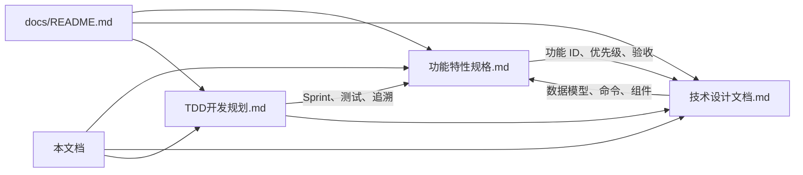

# 文档同步对照

> 当前同步版本：**功能规格 v1.6-draft / 技术设计 v1.6-draft**  

> 最后核对：2026-07-17

## 文档关系

| 文档 | 角色 |

|------|------|

| **功能特性规格** | 产品需求唯一来源（What） |

| **技术设计文档** | 架构与实现方案（How） |

| **TDD 开发规划** | TDD 任务分解与需求追溯（When / Test） |

| **文档同步对照** | 一致性检查与映射索引 |

## 版本同步检查清单

更新任一文档后，确认以下项：

- [ ] 两份文档头部版本号一致（`vX.Y-draft`）

- [ ] 修订记录表已追加一行

- [ ] 新增功能已分配功能 ID（功能规格）

- [ ] 新增功能已有数据模型 / 命令 / 组件（技术设计）

- [ ] 技术设计 §20.2 映射表已更新（如有新 ID）

- [ ] `docs/README.md` 与根 `README.md` 版本规划仍准确（如有里程碑变更）

## 模块同步矩阵

| 模块 | 功能规格 | 技术设计 | 同步 |

|------|----------|----------|------|

| 核心编辑 §3.1–3.5 | 命令 §8、Canvas §12 | ✅ |

| 复制/粘贴 ED-011 | §8.2.1 ClipboardPayload | ✅ |

| 自由主题 ED-006 | §8.2.2、floatingTopics | ✅ |

| 顶栏 §3.6 | TopBar §12.2 | ✅ |

| 底栏 §3.7 | StatusBar §12.2 | ✅ |

| 九种结构 §4 | StructureType §5.3、Layout §6.3 | ✅ |

| 插入菜单 §5.0 | InsertMenu §12.2 | ✅ |

| 概要/外框/关系 §5.2 | Summary/Boundary/Relationship §5.5、§6.6 | ✅ |

| 专区 §5.2.6 | Zone §5.5、layoutZone §6.6.5 | ✅ |

| 标注 §5.2.7 | Callout §5.4、layoutCallout §6.6.6 | ✅ |

| 待办/任务 §5.3 | TodoItem/TaskInfo §5.4 | ✅ |

| 评论 §5.3.3 | Comment §5.4、Sheet.comments、§8 命令 | ✅ |

| 方程 §5.4.1 | Topic.equation、UpdateEquationCommand | ✅ |

| 富文本标题 TE-002 | §5.9 InlineRun | ✅ |

| 贴纸/插画 EL-022/023 | §5.8 CanvasDecoration | ✅ |

| 右侧样式 Tab §6.3.1 | TopicStyle、StyleTab | ✅ |

| 演说 Tab §6.3.2 | PitchSettings、PitchTab | ✅ |

| 画布 Tab §6.3.3 | CanvasSettings、CanvasTab | ✅ |

| 全局主题 §6.1 | Theme §5.6、主题作用域 | ✅ |

| 大纲 §7.2 | Outliner §12.2 | ✅ |

| 打印 §11 | §10.9、PrintPreview | ✅ |

| ZEN / 小地图 §7.3、§3.4 | 无独立模型 | ⚠️ v0.3 UI 状态 |

| 分享 / AI §3.6、§12 | v2.0 延后 | ⏳ 刻意不同步 |

| 文件 IO §8 | §9 | ✅ |

| 导入 §8.3 | §10.6 Importer | ✅ |

| 导出 §8.4 | §10.1–10.8 | ✅ |

| 附件策略 | §9.6 | ✅ |

| 功能规格 §15 里程碑 | 技术设计 §18（16 周） | ✅ |

| 前端框架 Vue 3 | 技术设计 §2 | ✅（功能规格不涉及框架选型） |

## 已知刻意差异

以下为实现策略差异，**不算遗漏**：

| 功能规格 | 技术设计 | 原因 |

|----------|----------|------|

| SB-004 AI 点数 | 无实现章节 | v2.0 再做 |

| TB-001 云端分享链接 | 本地只读 JSON 副本已实现 | v2.0 协作链接 |

| CM-003–005 协作评论 | 本地评论 CRUD 已有；协作字段待后端 | v2.0 需后端 |

| VW-010 ZEN 模式 | 仅 UI 状态，无持久化 | 纯视图，v0.3 |

| Phase 2 PWA | 无 Service Worker 章节 | v0.2+ 再补 |

| EL-021 音频备注 | `AudioAttachment` + 上传 UI 已落地 | 录音增强可续 |

| FI-007 文件加密 | Web Crypto AES-GCM v2 + 兼容旧 XOR | 已实现 |

## 完整功能 ID 索引

详见 [技术设计文档 §20.2](./技术设计文档.md#202-功能-id--技术产物映射节选)。

